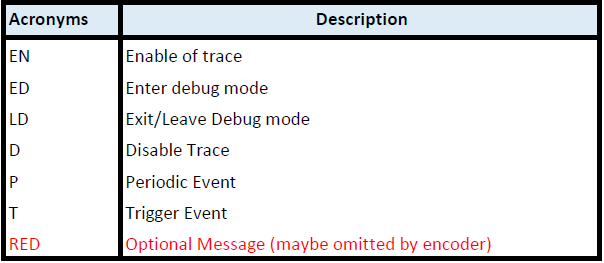
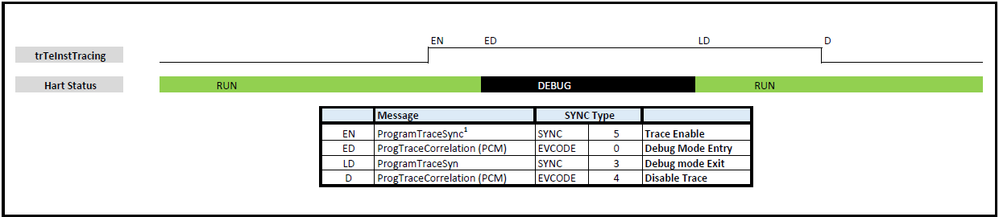
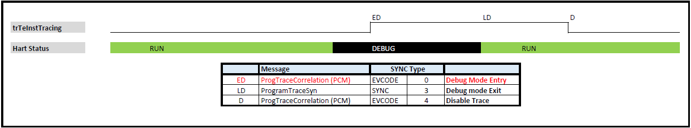
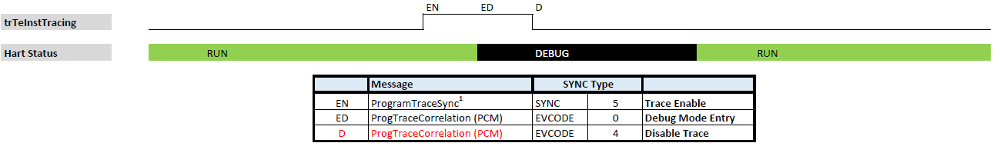
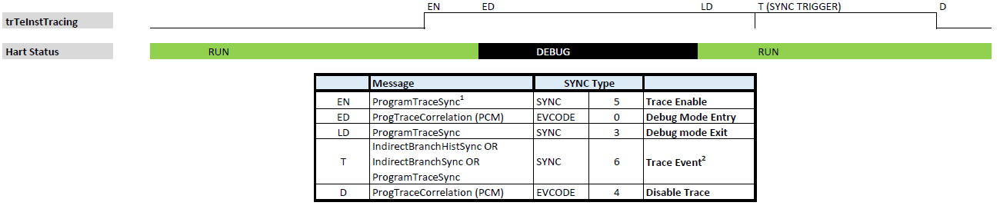
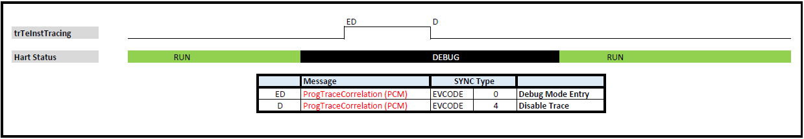
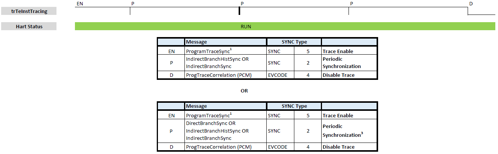

[[header]]
:description: RISC-V N-Trace (Nexus-based Trace)
:company: RISC-V.org
:revdate: Aug 14, 2024
:revnumber: 1.0_rc50
:revremark: Frozen state
:url-riscv: http://riscv.org
:doctype: book
:preface-title: Preamble
:colophon:
:appendix-caption: Appendix
:title-logo-image: image:docs-resources/images/risc-v_logo.svg[pdfwidth=3.25in,align=center]
// Settings:
:experimental:
:reproducible:
:WaveDromEditorApp: wavedrom-cli
:pdf-theme: ./riscv-pdf.yml
:pdf-fontsdir: docs-resources/fonts/
:imagesoutdir: images
:icons: font
:lang: en
:listing-caption: Listing
:sectnums:
:sectnumlevels: 5
:toclevels: 5
:toc: left
:source-highlighter: pygments
ifdef::backend-pdf[]
:source-highlighter: coderay
endif::[]
:data-uri:
:hide-uri-scheme:
:stem: latexmath
:footnote:
:xrefstyle: short
:bibtex-file: example.bib
:bibtex-order: alphabetical
:bibtex-style: apa

= RISC-V N-Trace (Nexus-based Trace) Specification
RISC-V N-Trace Task Group

// Preamble
[WARNING]
.This document is in the link:http://riscv.org/spec-state[Frozen state]
====
Change is extremely unlikely. A high threshold will be used, and a change will only occur because of some truly critical issue being identified during the public review cycle. Any other desired or needed changes can be the subject of a follow-on new extension.
====

[preface]
== Change Log

PDF generated on: {localdatetime}

=== Version 1.0_rc50
* 2024-08-14
** Frozen

[Preface]
== Copyright and license information

This specification is licensed under the Creative Commons Attribution 4.0 International License
(CC-BY 4.0). The full license text is available at https://creativecommons.org/licenses/by/4.0/

Copyright 2019-2024 by RISC-V International.

[Preface]
== Contributors
Key contributors to RISC-V N-Trace (Nexus-based Trace) specification in alphabetical order: +

Bruce Ableidinger (SiFive) => Initial SiFive donation, reviews +
Robert Chyla (IAR, SiFive, MIPS) => Most topics, editing, publishing +
Ernie Edgar (SiFive) => Initial SiFive donation, reviews +
Jay Gamoneda (NXP) => Reviews, contributing, editing +
Markus Goehrle (Lauterbach) => Reviews, updates +
Ved Shanbhogue (Rivos) => Detailed Architecture Review Committee notes +
Nino Vidovic (Segger) => Reviews

== Introduction to N-Trace

This *RISC-V N-Trace (Nexus based trace) Specification* is based on the well-established *IEEE-5001 Nexus Standard* tailored to support the trace of RISC-V ISA cores, harts and SoC/MCU designs.

It serves multiple audiences:

* N-Trace encoder logic/IP developers.
* Validation teams testing of N-Trace implementation.
* Debug and trace tools developers.
* Software programmers utilizing the trace for debugging and performance tuning of RISC-V-based systems.

This specification, together with the *RISC-V Trace Control Interface Specification* and *RISC-V Trace Connectors Specification* provide a complete, end-to-end, trace system for RISC-V based SoC.

A trace ingress port, which serves as the connection between the RISC-V hart and the trace system, is defined in the ratified *Efficient Trace for RISC-V Specification*.
This port enables the RISC-V hart to communicate execution information to the trace system.
The N-Trace encoder is responsible for encoding an execution flow into a stream of trace messages.
This document describes an appropriate selection of N-Trace messages compatible with the original IEEE-5001 Nexus Standard.

The primary objective was to define the program flow trace messages. Extensions have been introduced to enable better trace compression. Future versions may include IEEE-5001 Nexus-compatible data and bus trace.

The registers controlling the N-trace decoder are defined by the *RISC-V Trace Control Interface Specification*. This specification is shared with E-trace, so not all registers and register fields are supported by N-trace.

Trace connectors defined by IEEE-5001 Nexus Standard were debug oriented, so could not be directly applied. Instead, industry standard MIPI-compliant connectors are defined in *RISC-V Trace Connectors Specification*. These connectors are pure extensions of debug-only, MIPI-compliant connectors defined by ratified *RISC-V Debug Specification*.

=== Related Specifications

This document provides reference to separated documents developed together with this *RISC-V N-Trace Specification*:

[#RISC-V_Trace_Control_Interface]
* *RISC-V Trace Control Interface Specification* - Defines RISC-V trace control interface.
** This document is intended to be shared with ratified *Efficient Trace for RISC-V Specification*.
* *RISC-V Trace Connectors Specification* - Defines RISC-V trace connectors (for external trace probes).

[#E-Trace_Specification]

Ratified *Efficient Trace for RISC-V Specification* defines RISC-V Trace Ingress Port signals (chapter *4 Instruction Trace Interface*). At the moment of this writing this is version 2.0 (ratified May 5-th 2022).

NOTE: In the future trace ingress port may be defined in separated document - in such a a case reference to E-Trace specification will not be necessary.

////
This comment is taken AS-IS from iommu_intro.adoc file
Please in ditaa figures don't use the minus key '-' in your keyboard when
typing text (like 'non-privileged' in the figure below).
'-' is a special character that is used by ditaa to draw lines, not text.
Instead use a different unicode character that looks similar.
The figure below uses the unicode character with code U+2212 instead of the '-'
character of your keyboard (which has the unicode code U+002B).
Note that in your editor both probably look the same, but when rendered by
ditaa/asciidoc the '-' from your keyboard is used to draw a line, while the
alternative looks as a minus symbol.
If you don't know how to type an unicode character in your editor you might
simply copy the '−' character in the 'non−privileged' word from the drawing
below.
Other potential unicode characters might be found in the following links:
- https://www.compart.com/en/unicode/category/Pd
- https://www.compart.com/en/unicode/bidiclass/ES
////

=== Trace Encoder Interfaces

The diagram below shows one possible implementation with only a single RISC-V hart. In a system with multiple cores/harts the *Trace Ingress Port*, *Trace Encoder Control* and *Trace Encoder* blocks should be replicated for each hart.
The main *Trace Control Layer* controlling other (shared) components in the trace system is not replicated.

[[fig:trace-encoder-interfaces]]
.Trace Encoder Interfaces
["ditaa",shadows=true, separation=false, fontsize: 14]
....

                      +--- Control register
                      |    read/write
                      |
      +----------+    V    +---------------------+     
      |          |         | Trace Control Layer |
      | Debug    |<=======>|                     |-----> Control of other
      | Module   |         |  +-------------+    |       trace components 
      |          |<------->|  |Trace Encoder|    |       (transport/storage)
      +----------+    ^    +--|  Control    |----+
            ^         |       +-------------+
            | <--- triggers,      ^
            |      stall etc.     |
            V                     | <------ Encoder control/status signals
+----------------+                |         (bits/fields in registers)
| RISC−V Hart    |                V
|          +---------+       +---------+     
|          |  Trace  |       |  Trace  |                To N−Trace transport
|          | Ingress |======>| Encoder |==============> for multiplexing/
|          |  Port   |   ^   |         |       ^        storage/export
|          +---------+   |   +---------+       |
|                |       |                     +--- Encoded trace messages
|                |       |   Ingress port           for single hart (with
+----------------+       +-- signals defined        optional source ID)
                             in E−Trace spec
....

NOTE: Placement of the Trace Encoder and Trace Control Layer are implementation dependent. 

=== Definitions and Terminology

[#Terms Used In This Specification]
.Terms Used In This Specification
[cols="20%,~",options="header"]
|======================================================================================================
|Term| Definition
|Message|N-Trace messages are sequences of bytes. First byte of every message includes the TCODE field, which defines the type of information carried in the message and its format. When messages are transmitted or stored, a protocol, described in <<N-Trace Transmission Protocol,N-Trace Transmission Protocol>> chapter, defines the start and the end of each message.

|Field| A field is a distinct piece of the information contained within a message, and messages may contain one or more fields (in addition to the first TCODE field). Fields can be either of fixed-length or variable-length. Several fields may be packed into single byte and single field may span multiple bytes. Definitions of all fields can be found in <<Fields in Messages,Fields in Messages>> chapter.

|Variable-length Field|Specifying that a field is variable-length (*Var* used as field size definition) means that the message must contain the field, but the field's size may vary from a minimum of 1 bit. When messages are transmitted or stored, variable-length fields must end on a byte boundary. If necessary, they must zero-fill bit positions beyond the highest order bit of the variable-length data. Because variable-length fields may be of different lengths in messages of the same type, when messages are transmitted or stored, a protocol, described in <<N-Trace Transmission Protocol,N-Trace Transmission Protocol>> chapter, defines the end of each variable-length field.

|Configurable Field|Configurable field (*Cfg* used as field size) means that existence and size of this field depends on some configuration setting. See <<N-Trace Specific Trace Controls,N-Trace Specific Trace Controls>> chapter for details.
|N-Trace| IEEE-5001 Nexus Standard Based Trace for RISC-V (as defined by this specification).
|E-Trace| Efficient Trace for RISC-V (as defined by <<E-Trace_Specification,E-Trace Specification>>).
|Unconditional Jump|On RISC-V ISA all jump instructions are always unconditional, but these two words are always used together to avoid any confusions with the term 'branch' used by the IEEE-5001 Nexus Standard. The two main sub-categories of unconditional jumps that are relevant for tracing are: direct unconditional jump and indirect unconditional jump.
|Direct Conditional Branch|On RISC-V ISA all branch instructions are always direct and conditional (and also relative), but these three words are always used together to avoid confusion with the term 'branch' used by the IEEE-5001 Nexus Standard.
|======================================================================================================

== Trace Ingress Port

N-Trace uses the same ingress port as specified in <<E-Trace_Specification,E-Trace Specification>> (chapter *4 Instruction Trace Interface*).

* As this specification does not define the data trace yet, sub-chapters *4.3 Data Trace Interface requirements* and *4.4 Data Trace Interface* are not applicable.
* It is an ambition to extract single, shared *RISC-V Trace Ingress Port* specifications (combining this chapter with relevant E-Trace chapter). 
** Names of 'itype' values used in this specification are a bit different than names in E-Trace specification. These names were unconditionally enforced by ARC (during review phase) as compulsory in all relevant specifications from now on.

The table below provides a detailed mapping of causes for terminating an instruction block to the corresponding *itype* encoding. It could be used during development of ingress port logic inside of a hart. For some instructions operands matter - for example *JALR rd,rs1* instruction may generate 5 different, distinct *itype* values.

[#Generating itype for different instructions]
.Generating itype for different instructions
[cols="18%,~,35%",options="header"]
|======================================================================================================
|Instruction|Condition/Notes|itype Value/Name
|Exception in instruction|An exception trap that occurred following the final retired instruction in the block.|1 = Exception
|EBREAK, ECALL, C.EBREAK|An exception trap that occurred following the final retired instruction in the block due to these instructions. These instructions do not retire.
|1 = Exception
|Interrupted instruction|An interrupt trap occurred following the final retired instruction in the block.|2 = Interrupt
|MRET, SRET| Return from an exception or interrupt handler. |3 = Trap return
|<<itype_branch,Conditional branch>>|Not-taken direct, conditional branch.|4 = Not-taken branch
|<<itype_branch,Conditional branch>>|Taken direct, conditional branch.|5 = Taken branch
|Any other instruction|All other instructions that are not directly listed in this table.
|0 = No special type
3+|*Values of itype (<<itype_3_4,3-bit>>) (without <<Implicit Return Optimization,Implicit Return Optimization>>*)
|JAL rd         |Any direct jump/call.                      |0 = No special type
|JALR rd, rs    |Any indirect jump/call.                    |6 = Indirect jump (with or without linkage)
|C.J or C.JAL   |C extension has direct jump/calls only.    |0 = No special type
|CM.JT          |Defined by <<zcmt,Zcmt>> extension.        |0 = No special type
|CM.JALT        |Defined by <<zcmt,Zcmt>> extension.        |0 = No special type
|CM.POPRET*     |Defined by **Zcmp** extension.             |6 = Indirect jump (with or without linkage)
3+|*Values of itype (<<itype_3_4,4-bit>>) (needed for <<Implicit Return Optimization,Implicit Return Optimization>>*). <<link,link>> means *x1* or *x5*.
|JAL rd         |rd = `link`                                |9 = Direct call
|               |rd = *x0*                                  |11 = Direct jump (without linkage)
|               |rd != `link` and rd != *x0*                |15 = Other direct jump (with linkage)
|JALR rd, rs    |rd = `link` and rs != `link`               |8 = Indirect call
|               |rd = `link` and rs = `link` and rd = rs    |8 = Indirect call
|               |rd = `link` and rs = `link` and rd != rs   |12 = Co-routine swap
|               |rd != `link` and rs = `link`               |13 = Function return
|               |rd = *x0* and rs != `link`                 |10 = Indirect jump (without linkage)
|               |rd != `link` and rd != *x0* and rs != `link` |14 = Other indirect jump (with linkage)
|C.JAL          |Expands to `JAL x1, offset`                |9 = Direct call
|C.JALR rs      |rs = *x5*                                  |12 = Co-routine swap
|               |rs != *x5*                                 |8 = Indirect call
|C.JR rs        |rs = `link`                                |13 = Function return
|               |rs != `link`                               |10 = Indirect jump (without linkage)
|C.J            |Expands to `JAL x0, offset`                |11 = Direct jump (without linkage)
|CM.JT          |Defined by <<zcmt,Zcmt>> extension.        |11 = Direct jump (without linkage)
|CM.JALT        |Defined by <<zcmt,Zcmt>> extension.        |9 = Direct call
|CM.POPRET*     |Defined by **Zcmp** extension.             |13 = Function return
|======================================================================================================

[[itype_branch]]
NOTE: Branches (*itype*=4, 5) are always conditional, direct branches. In RISC-V ISA all jumps, calls, returns are always unconditional.

[[itype_3_4]]
NOTE: Extended 4-bit *itype* (codes 8..15) are only necessary when <<Implicit Return Optimization,Implicit Return Optimization>> is implemented.

[[link]]
NOTE: Symbol `link` means register *x1* or *x5* as specified in *The RISC-V Instruction Set Manual, Volume I: Unprivileged ISA* document.

[[zcmt]]
NOTE: Jump instructions (CM.JT and CM.JALT) defined by ratified *Zcmt* extension are handled as direct (inferable) jumps as jump tables are assumed to be static and known to the decoder.

Table below defines how N-Trace encoder should handle different 3-bit *itype* values on trace ingress port.

[#Handling of 3-bit itype values]
.Handling of 3-bit itype values
[cols="5%,20%,75%",options="header"]
|======================================================================================================
|#|itype|Encoder Action
|0|No special type|Only update <<field_I-CNT,I-CNT>> field.
|1|Exception|Update <<field_I-CNT,I-CNT>> field. +
Emit Indirect Branch message with <<field_B-TYPE,B-TYPE>>=2 or 1. +
*IMPORTANT:* An address emitted is known at the next valid ingress port cycle.
|2|Interrupt|Update <<field_I-CNT,I-CNT>> field. +
Emit Indirect Branch message with <<field_B-TYPE,B-TYPE>>=3 or 1. +
*IMPORTANT:* An address emitted is known at the next valid ingress port cycle.
|3|Trap return|Update <<field_I-CNT,I-CNT>> field. +
Emit Indirect Branch message with <<field_B-TYPE,B-TYPE>>=0. +
*IMPORTANT:* An address emitted is known at the next valid ingress port cycle.
|4|Not-taken branch|*For <<mode_BTM,BTM>> mode:* +
  Only update <<field_I-CNT,I-CNT>> field.

*For <<mode_HTM,HTM>> mode:* +
  Update <<field_I-CNT,I-CNT>> field. +
  Add 0 as least significant bit to <<field_HIST,HIST>> field.
|5|Taken branch|*For <<mode_BTM,BTM>> mode:* +
  Update <<field_I-CNT,I-CNT>> field. +
  Generate <<msg_DirectBranch,DirectBranch>> message.

*For <<mode_HTM,HTM>> mode:* +
Update <<field_I-CNT,I-CNT>> field. +
Add 1 as least significant bit to <<field_HIST,HIST>> field.
|6|Indirect jump (with or without linkage)|Update <<field_I-CNT,I-CNT>> field. +
Emit Indirect Branch message with <<field_B-TYPE,B-TYPE>>=0. +
*IMPORTANT:* An address emitted is known at the next valid ingress port cycle.
|7|Reserved|-
|======================================================================================================

When the *itype* input of ingress port is 4-bit wide, the Indirect jump (with or without linkage) *itype=6* should not be generated and one of the following values should be generated instead. Encoder must handle call stack action as described in the <<Implicit Return Optimization,Implicit Return Optimization>> chapter (if enabled).

[#Handling of 4-bit itype values]
.Handling of 4-bit itype values
[cols="5%,20%,63%,12%",options="header"]
|======================================================================================================
|#|itype|Encoder Action|Stack Action
|8|Indirect call|Update <<field_I-CNT,I-CNT>> field. Emit Indirect Branch message with <<field_B-TYPE,B-TYPE>>=0.|Push
|9|Direct call|Only update <<field_I-CNT,I-CNT>> field.|Push
|10|Indirect jump (without linkage)|Update <<field_I-CNT,I-CNT>> field. +
Emit Indirect Branch message with <<field_B-TYPE,B-TYPE>>=0. +
<<same_handling,Same handing>> as *itype=14*.|-
|11|Direct jump (without linkage)|Only update <<field_I-CNT,I-CNT>> field. +
<<same_handling,Same handing>> as *itype=15*.|-
|12|Co-routine swap|Update <<field_I-CNT,I-CNT>> field. +
If Pop does not returns the same address as PC at next valid ingress port cycle, emit Indirect Branch message with <<field_B-TYPE,B-TYPE>>=0.|Pop,Push
|13|Return|Update <<field_I-CNT,I-CNT>> field. +
If Pop does not returns the same address as PC at next valid ingress port cycle, emit Indirect Branch message with <<field_B-TYPE,B-TYPE>>=0.
|Pop
|14|Other indirect jump (with linkage)|Update <<field_I-CNT,I-CNT>> field. +
Emit Indirect Branch message with <<field_B-TYPE,B-TYPE>>=0. +
<<same_handling,Same handing>> as *itype=10*.|-
|15|Other direct jump (with linkage)|Only update <<field_I-CNT,I-CNT>> field. +
<<same_handling,Same handing>> as *itype=11*.|-
|======================================================================================================

[[same_handling]]
IMPORTANT: N-Trace messages do not differentiate instructions classified as *... jump (with linkage)* and *... jump (without linkage)*, so both N-Trace ingress ports and N-Trace encoders implementations may ignore differences between *with/without linkage* values.

If optional <<trTeInstEnAllJumps,trTeInstEnAllJumps>> bit is set, trace ingress port is required to report *itype*=5 (Taken branch) for all direct unconditional jumps, which are normally reported as *itype* = 0 or 15. 

IMPORTANT: The N-Trace encoder does not require *cause* and *tval* ingress port
signals, which are valid only for exceptions and interrupts, as these
details are not reported in N-Trace messages. Instead, N-Trace solely
provides the address of the exception or interrupt handler.

NOTE: Since almost every ingress port cycle updates I-CNT, there is a possibility
of overflow. For more information, see <<I-CNT Details, I-CNT Details>> chapter regarding
I-CNT management and overflow handling.

== N-Trace Transmission Protocol

The IEEE-5001 Nexus Standard defines a trace messaging protocol using several *MDO* (Message Data Out) signals and one or two flag signals known as *MSEO* (Message Start/End Out). A Nexus message is sent or stored in a record composed of *MDO* and *MSEO*. 

N-Trace specification defines 6-bit *MDO* and 2-bit *MSEO* so both fit in a single byte.

* It allows easy storage in memory as well as sending using 1-bit/ 2-bit/ 4-bit/ 8-bit/ 16-bit parallel transport (which is supported by many existing trace probes and connectors).
* Decoding software may work on bytes and 32-bit/64-bit words and expect MSEO bits at two least significant bits of each byte.

N-Trace message transmission protocol is a strict subset of IEEE-5001 Nexus Standard trace messaging protocol.

[N-Trace subset]
.N-Trace subset
[cols="25%,20%,~",options="header"]
|====
|Protocol Feature|Nexus Standard|N-Trace (strict subset of Nexus)
|Number of *MSEO* bits|1 or 2|2
|Number of *MDO* bits|At least 1|6
|Total (*MDO*+*MSEO*) bits|At least 2|8 (one byte)
|Order (transmitted or stored)|Vendor defined|*MSEO* before *MDO*,  least significant bit for each field first
|Max field size|Not specified|64 bits (some 32 bits or less)
|Max standard message size|Not specified|38 bytes (maximum sum of all fields)
|====

The maximum standard message size of 38 bytes in this version of the specification is
 to transmit <<msg_IndirectBranchHistSync,IndirectBranchHistSync>> message which includes TCODE/ SRC/ SYNC/ B-TYPE(5 bytes total), I-CNT(30 bits, 5 bytes), F-ADDR(63 bits, 11 bytes), HIST(32 bits, 6 bytes) TSTAMP(64 bits, 11 bytes).

While implementations may have a shorter maximum message size (e.g. due to I-CNT being smaller), they must assure that the internal FIFOs are designed to hold at least two maximum sized messages that the implementation can produce.

While decoding software may be designed to avoid dynamic memory allocation, it must nonetheless be robust enough to handle messages of any size. This is to account for scenarios when a trace memory could be corrupted, such as a trace consisting entirely of zeros, which could be interpreted as an unusually long variable-length field.

Custom messages and fields may carry different payloads and may be larger than 64 bits and 38 bytes.

=== MSEO Sequences

*MSEO[1:0]* bits (located in the least significant bits of each byte) are defined by the follow rules:

* The first byte of a message sends the least significant bits of the message and is indicated by *MSEO[1:0]=00*.
* Bytes occupied by fixed-length fields are sent using *MSEO[1:0]=00*.
* The last byte of a variable-length field, that is not last byte of a message, is indicated by *MSEO[1:0]=01*.
** A variable-length field in a message always ends on a byte boundary (zero extended as needed).
** The non-last bytes of a variable-length fields are indicated by *MSEO[1:0]=00*.
* The last byte of a message is indicated by *MSEO[1:0]=11*.
** It also implies an end of the last (fixed-length or variable-length) field of a message.
* Idle bytes (between messages or used as padding) are indicated by *MSEO[1:0]=11* and *MDO[5:0]=111111* (entire byte is *0xFF*).
* Value of *MSEO[1:0]=10* is reserved for future extensions.

The table below provides possible sequences of *MSEO[1:0]* bits (to expand above rules - *highlighted* MSEO represent the actual function): 

[#MSEO Transitions]
.Transitions of MSEO Bits 
[cols="40%,60%",options="header",align=center,width=80%]
|====
|MSEO Function|Previous-*Current* MSEO[1:0] Sequence
|Start of message|11-*00*
|Middle of field|00 (or 01)-*00*
|End of variable-length field|00 (or 01)-*01*
|End of message|00 (or 01)-*11*
|Idle (no message)|11-*11*
|Reserved|11-*01*
|Reserved|any-*10*
|====

[NOTE]
====
Original IEEE-5001 Nexus Standard defines the MSEO protocol as follows:

* Two `1`-s followed by one `0` indicates the start of a message.
* `0` followed by two or more `1`-s indicates the end of a message.
* `0` followed by `1` followed by `0` indicates the end of a variable-length field.
* `0`-s at all other clocks during transmission of a message.
* `1`-s at all clocks during no message transmission (idle).

Dual MSEO protocol (utilized by this N-Trace specification) is a two-pin mode of this general (single and dual) MSEO protocol definition.
====

=== Unified N-Trace Message Structure

Each N-Trace message has identical structure (100% compatible with IEEE-5001 Nexus Standard):

* Very first field is always fixed-length *TCODE* (Transport Code) which defines the meaning and format of subsequent fields.
* In case of simultaneous tracing from more than one hart, the second field is always fixed-length *SRC* (Message Source) field, which provides a unique ID of message source.
** This field allows trace decoders to separate messages from different trace sources (Trace Encoders, harts) without knowing any details of each of the messages.
** This method can be used to handle different (opaque) trace or debug or performance data using N-Trace transport/storage/export infrastructure. 
* One or more (fixed-length or variable-length) payload fields. Sequence and selection of these fields depend on the value of *TCODE* field.
** In some rare cases one of preceding fields may define number of following fields.
* Very last field is (optional) variable-length *TSTAMP* (Timestamp) field.   
** It may be possible to generate and analyze timestamps in a unified (simpler) way.

=== Order of bits and bytes

Order of bits and bytes:

* Trace messages/packets are considered as sequences of bytes and are always transmitted with least significant bits/bytes first.
* IEEE-5001 Nexus Standard MSEO bits are transmitted on the least significant part and bit#0 first.
* Idle state must be transmitted as all 1s MSEO and MDO bits.
* For transmission on a 16bit interface (e.g. PIB 16-bit mode), the first byte of message/packet is transmitted on the least significant part and the MSEO of the second/odd byte is transmitted on bits #8-#9 and MDO on bits #10-#15.

NOTE: Above rules allow receiving trace probes to skip idle messages.

=== PIB Idle Cycles Explained

This chapter describes N-Trace specific details about the transmission via a Pin Interface Block (PIB), as it is described in the <<RISC-V_Trace_Control_Interface,RISC-V Trace Control Interface>> Specification.

Trace messages may start on any (positive or negative) edge of trace clock. 

IMPORTANT: Once a message is started all bits of that message must be transmitted on consecutive trace clock edges (both positive and negative).

Said so, an idle sequence may be sent using any number of trace clock edges (positive or negative).

To explain this let's assume the following serially transmitted (in 1-bit PIB mode) sequences of bits (MSEO[0] bit being first on the left):

* < `11` DDDDDD> - 8 bits in a last byte of a message (`11` = MSEO, DDDDDD = DATA bits)
* < `1*n` >      - sequence of `n`-bits long idle bits (each must be `1`)
* < `00` TTTTTT> - 8 bits in a first byte of a message (`00` = MSEO, TTTTTTT = TCODE bits)

The following 4 example sequences are all valid:

* ... < `11` DDDDDD> < `00` TTTTTT> ...           => No idle bits/cycles between consecutive messages.
* ... < `11` DDDDDD> < `1*2` > < `00` TTTTTT> ... => Two (even) idle bits.
* ... < `11` DDDDDD> < `1*3` > < `00` TTTTTT> ... => Three (odd) idle bits (second message starts at another trace clock edge).
* ... < `11` DDDDDD> < `1*8` > < `00` TTTTTT> ... => 8 idle bits (idle sequence can be considered as byte 0xFF).

Some implementations may always send idle sequences using even (or even multiple of 8) number of trace clocks - in such a case all messages will always start on a positive or negative trace clock. But conformant trace probes must handle any number of idle clocks.

[NOTE]
====
The trace probe needs to be able to synchronize with the trace stream and to detect trace message boundaries. This procedure is sometimes referred to as "message alignment synchronization" or "alignment-sync".

For 8-bit or 16-bit trace idle cycles are not required (to detect an alignment) as MSEO bits are in well-defined positions and trace probes will know where is a start of a message.

For 1-bit, 2-bit and 4-bit trace modes PIB must generate at least one idle byte to allow trace probes to detect which bit is the first MSEO bit of a message.
How it is done is not defined in this specification. Here are two possible implementations:

* Generate at least one idle byte periodically in a trace stream anywhere between messages (PIB is aware about message boundaries as end of message has MSEO=11 bits). 
* Always add an extra idle byte before sending synchronizing messages. It will guarantee that boundaries of every synchronizing message are always detectable and decoding may start from it.
====

=== N-Trace Message Example

Table below shows one N-Trace message with several fields. It is an output from N-Trace dump tool (part of N-Trace reference C code) with an added *Explanation* column.

[#MDO_MSEO Examples]
.MDO and MSEO Encoding Example
[cols="6%,10%,10%,18%,~",options="header"]
|====
|Byte|MDO [5:0]|MSEO [1:0]|Decoded (by reference tool)|Explanation
|0xFF| 111111|11 | Idle | Most likely idle but can also be the last byte of the previous message.
|0x70| 011100|00 | TCODE[6] = 28 - IndirectBranchHist| First byte, all 6 MDO bits have TCODE.
5+|Here we could have an SRC field (it would shift the start of B-TYPE).
|0xD0| 110100|00 | B-TYPE[2] = 0x0| This is a 2-bit (fixed-length) field. As B-TYPE is a fixed-length field, four most significant bits are part of the next field (I-CNT).
|0x1D| 000111|01 | I-CNT[10] = 0x7D| This is a second byte of the 10-bit (value 0x7D) variable-length I-CNT field. Four least significant bits (0b1101=0xD) are defined in previous MDO. Three most significant bits are all 0-s as variable-length field uses all 6 MDO bits.
|0x1D| 000111|01 | U-ADDR[6] = 0x7| This is a single byte variable-length U-ADDR field (with three most significant 0-s).
|0xF8| 111110|00 || Normal transfer of new field (6 least significant bits).
|0xFF| 111111|11 | HIST[12] = 0xFFE| Last byte of message. It implies the end of the 12-bit HIST field. In this field we do not have any extra most significant 0-s.
5+|Here optional TSTAMP field could be sent +
(Previous MSEO should became 01 encoding end of HIST field, but not end of the message).
|0xFF| 111111|11 | Idle|This is idle as this is the second byte with MSEO=11 (NOTE: Last byte of message is also 0xFF).
|====

== N-Trace Specific Trace Controls

This chapter describes how fields and bits from Trace Encoder control registers (named using *trTe...* pattern) are influencing N-Trace encoder and N-Trace protocol messages. N-Trace specific clarifications, in addition to description in <<RISC-V_Trace_Control_Interface,RISC-V Trace Control Interface>> specification are provided. 

NOTE: The table below does not provide names of Trace Encoder control registers as names of bits/fields used in Trace Control Interface are unique.

[#Details_Control_Parameters]
.Trace Encoder Parameters and Controls
[cols="25%,15%,~",options="header"]
|======================================================================================================
|Trace Control Field|Applicability|Description
|trTeActive |*Required*|See <<RISC-V_Trace_Control_Interface,RISC-V Trace Control Interface>> Specification.
|trTeEnable |*Required*|See <<RISC-V_Trace_Control_Interface,RISC-V Trace Control Interface>> Specification.
|trTeInstTracing |*Required*|See <<RISC-V_Trace_Control_Interface,RISC-V Trace Control Interface>> Specification.
|trTeEmpty |*Required*|See <<RISC-V_Trace_Control_Interface,RISC-V Trace Control Interface>> Specification.
[[trTeInstMode]]
|trTeInstMode |*Required*|
*3:* Generate instruction trace using <<mode_BTM,BTM>> (Branch Trace Messaging) mode. +
*6:* Generate instruction trace using <<mode_HTM,HTM>> (History Trace Messaging) mode. +
*0, 7:* See <<RISC-V_Trace_Control_Interface,RISC-V Trace Control Interface>> Specification. +
*1-2, 4-5:* Reserved for future N-Trace use. +
At least a value of *3* or *6* must be settable.
[[trTeContext]]
|trTeContext|Optional|Controls generation of <<msg2_Ownership,Ownership>> messages.
|trTeInstTrigEnable |Optional|See <<RISC-V_Trace_Control_Interface,RISC-V Trace Control Interface>> Specification.
|trTeInstStallOrOverflow |*Required*|See <<RISC-V_Trace_Control_Interface,RISC-V Trace Control Interface>> Specification.
|trTeInstStallEna |Optional|See <<RISC-V_Trace_Control_Interface,RISC-V Trace Control Interface>> Specification.
[[trTeInhibitSrc]]
|trTeInhibitSrc|Optional|Controls generation of <<field_SRC,SRC>> field.
[[trTeInstSyncMode]]
|trTeInstSyncMode |*Required*|Controls generation of <<Synchronizing Messages,Synchronizing Messages>> with <<field_SYNC,SYNC>> field=2.
[[trTeInstSyncMax]]
|trTeInstSyncMax |*Required*|Controls generation of <<Synchronizing Messages,Synchronizing Messages>> with <<field_SYNC,SYNC>> field=2.
|trTeFormat |*Required*|Must be set to *1* (which denotes N-Trace format).
|trTeVerMajor |*Required*|See <<RISC-V_Trace_Control_Interface,RISC-V Trace Control Interface>> Specification.
|trTeVerMinor |*Required*|See <<RISC-V_Trace_Control_Interface,RISC-V Trace Control Interface>> Specification.
|trTeCompType |*Required*|See <<RISC-V_Trace_Control_Interface,RISC-V Trace Control Interface>> Specification.
[[trTeProtocolMajor]]
|trTeProtocolMajor|*Required*|*Must be 1* to encode this version (1.0) of N-Trace protocol. Value different than 1 is considered a non-compatible version and must be rejected by the trace tool if it is only compliant with version 1.0 of the N-trace protocol.
[[trTeProtocolMinor]]
|trTeProtocolMinor|*Required*|*Must be 0* to encode this version (1.0) of N-Trace protocol. When trTeProtocolMajor is 1, values other than 0 are considered down compatible extension and should be accepted by the trace tool. Any future non-compatible feature should be specifically enabled (by new control bits), so older tools (which never set these new bits) should work with it.
|trTeInstNoAddrDiff|Not applicable|Must be hard coded as *0*.
|trTeInstNoTrapAddr|Not applicable|Must be hard coded as *0*.
[[trTeInstEnSequentialJump]]
|trTeInstEnSequentialJump|Optional|See <<Sequential Jump Optimization,Sequential Jump Optimization>> chapter.
[[trTeInstEnImplicitReturn]]
|trTeInstEnImplicitReturn|Optional|See <<Implicit Return Optimization,Implicit Return Optimization>> chapter.
|trTeInstEnBranchPrediction|Not applicable|Must be hard coded as *0*.
|trTeInstEnJumpTargetCache|Not applicable|Must be hard coded as *0*.
[[trTeInstImplicitReturnMode]]
|trTeInstImplicitReturnMode|Optional|See <<Implicit Return Optimization,Implicit Return Optimization>> chapter.
[[trTeInstEnRepeatedHistory]]
|trTeInstEnRepeatedHistory|Optional|See <<Repeated History Optimization,Repeated History Optimization>> chapter.
[[trTeInstEnAllJumps]]
|trTeInstEnAllJumps|Optional|See <<RISC-V_Trace_Control_Interface,RISC-V Trace Control Interface>> Specification.
[[trTeInstExtendAddrMSB]]
|trTeInstExtendAddrMSB|Optional|See <<Virtual Addresses Optimization, Virtual Addresses Optimization>> chapter.
[[trTeSrcID]]
|trTeSrcID|Optional|Controls generation of <<field_SRC,SRC>> field.
[[trTeSrcBits]]
|trTeSrcBits|Optional|Controls generation of <<field_SRC,SRC>> field.
|trTeInstFilters|Optional|See <<RISC-V_Trace_Control_Interface,RISC-V Trace Control Interface>> Specification.
|trTeDataImplemented|Not applicable|*Must be 0* as IEEE-5001 Nexus Standard data trace messages are not part of version 1.0 of N-Trace specification.
|*Other* trTeData...|Not applicable|*Must be 0* as IEEE-5001 Nexus Standard defines data trace messages, future versions of N-Trace may allow these (as an optional extension).
|*All* trTeTrig...|Optional|See <<RISC-V_Trace_Control_Interface,RISC-V Trace Control Interface>> Specification.
|*All* trTeFilter...|Optional|See <<RISC-V_Trace_Control_Interface,RISC-V Trace Control Interface>> Specification.
|*All* trTeComp...|Optional|See <<RISC-V_Trace_Control_Interface,RISC-V Trace Control Interface>> Specification.
[[trTsEnable]]
|trTsEnable|Optional| Part of potentially shared Timestamp Unit controls generation of <<field_TSTAMP,TSTAMP>> field. See <<RISC-V_Trace_Control_Interface,RISC-V Trace Control Interface>> Specification for details of the Timestamp Unit.
|======================================================================================================

== Main N-Trace Trace Modes

RISC-V N-Trace defines two instruction trace modes:

[[mode_BTM]]
* *Branch Trace Messaging (BTM)* - each taken direct conditional branch generates a minimum two-byte message. However, repeated branches can be aggregated and reported as a single message with a count, rather than numerous identical messages. 

[[mode_HTM]]
* *History Trace Messaging (HTM)* - every direct conditional branch, whether taken or not-taken, contributes a single bit to the history buffer, significantly enhancing the trace efficiency.

The encoder is required to implement at least one of these modes. Both may be supported, but is not required.

[NOTE]
====
Above modes correspond to the following IEEE-5001 Nexus Standard instruction trace modes:

* *Branch Trace Messaging using Traditional Messages*

* *Branch Trace Messaging using Branch History Messages*
====

IMPORTANT: The IEEE-5001 Nexus Standard defines different conformance levels. These levels are not directly applicable to N-Trace as Nexus levels always include debug levels. Different N-Trace options are provided in <<N-Trace Specific Trace Controls,N-Trace Specific Trace Controls>> chapter.

== N-Trace Messages (Overview)

IMPORTANT: The terminology `Indirect Branch` as used by the IEEE-5001 Nexus Standard may lead to confusion, given that the RISC-V ISA exclusively permits direct conditional branches, which are always relative. Furthermore, the RISC-V ISA makes a distinction between 'jump' (unconditional flow change) and 'branch' (conditional flow change), a differentiation not observed in Nexus terminology, where any flow change, including exceptions and interrupts, is uniformly referred to as a 'branch'. This specification employs the terms 'branch' and 'jump' as defined by RISC-V ISA.

// [#Fields in Messages]
=== Fields in Messages

The table presented below enumerates all message types that can be generated, with each row comprehensively defining the fields associated with a particular message type. Fields that are present in different messages are consistently ordered.

Message field attributes are described using the following terminology:

* *[n]*: A fixed-length field that is *n* bits wide.
* *[Var]*: A variable-length, non-empty (at least 1-bit wide), field.
* *[Cfg]*: A configurable field, where the existence and size depend on the encoder configuration options.

.Fields in Messages
[cols="22%,8%,5%,6%,8%,14%,7%,8%,8%,~",options="header",]
|===========================================================================================
| Message ID/Field [size]|<<field_TCODE,TCODE>> [6]|<<field_SRC,SRC>> [Cfg]|<<field_SYNC,SYNC>> [4]|<<field_B-TYPE,B-TYPE>> [2]|Other fields|<<field_I-CNT,I-CNT>> [Var]|<<Address Compression,x-ADDR>> [Var]|<<field_HIST,HIST>> [Var]|<<field_TSTAMP,TSTAMP>> [Var,Cfg]
|[[msg_Ownership]]<<msg2_Ownership,Ownership>>   |2    |Cfg|    |     |<<field_PROCESS,PROCESS>> *[Var]*        |    |     ||Cfg
|[[msg_DirectBranch]]<<msg2_DirectBranch,DirectBranch>>          |3    |Cfg|    |     |                  |Yes |     ||Cfg
|[[msg_IndirectBranch]]<<msg2_IndirectBranch,IndirectBranch>>        |4    |Cfg|    |Yes  |                  |Yes |<<field_U-ADDR,U-ADDR>>||Cfg
|[[msg_Error]]<<msg2_Error,Error>>                 |8    |Cfg|    |     |<<field_ETYPE,ETYPE>> *[4]* + <<field_ECODE,ECODE>> *[Var]*  |    |     ||Cfg
|[[msg_ProgTraceSync]]<<msg2_ProgTraceSync,ProgTraceSync>>         |9    |Cfg|Yes |     |                  |Yes |<<field_F-ADDR,F-ADDR>>||Cfg
|[[msg_DirectBranchSync]]<<msg2_DirectBranchSync,DirectBranchSync>>      |11   |Cfg|Yes |     |                  |Yes |<<field_F-ADDR,F-ADDR>>||Cfg
|[[msg_IndirectBranchSync]]<<msg2_IndirectBranchSync,IndirectBranchSync>>    |12   |Cfg|Yes |Yes  |                  |Yes |<<field_F-ADDR,F-ADDR>>||Cfg
|[[msg_ResourceFull]]<<msg2_ResourceFull,ResourceFull>>          |27   |Cfg|    |     |<<field_RCODE,RCODE>> *[4]* + <<field_RDATA,RDATA>> *[Var]*|    |     ||Cfg
|[[msg_IndirectBranchHist]]<<msg2_IndirectBranchHist,IndirectBranchHist>>    |28   |Cfg|    |Yes  |                  |Yes |<<field_U-ADDR,U-ADDR>>|Yes|Cfg
|[[msg_IndirectBranchHistSync]]<<msg2_IndirectBranchHistSync,IndirectBranchHistSync>>|29   |Cfg|Yes |Yes  |                  |Yes |<<field_F-ADDR,F-ADDR>>|Yes|Cfg
|[[msg_RepeatBranch]]<<msg2_RepeatBranch,RepeatBranch>>          |30   |Cfg|    |     |<<field_B-CNT,B-CNT>> *[Var]*           |    |     ||Cfg
|[[msg_ProgTraceCorrelation]]<<msg2_ProgTraceCorrelation,ProgTraceCorrelation>>  |33   |Cfg|    |     |<<field_EVCODE,EVCODE>> *[4]* + <<field_CDF,CDF>> *[2]* |Yes |     |*Cfg*|Cfg
|<<msg_other,Vendor Defined>>|56..62|Cfg 7+| Designated for use by Vendor Defined messages
|<<msg_other,Reserved>>|other|Cfg 7+| Reserved for future extensions of N-Trace specification
|===========================================================================================

IMPORTANT: Any message may include the optional <<field_TSTAMP,TSTAMP>> *[Var,Cfg]* field as the very last field of a message. It must be enabled by <<trTsEnable,trTsEnable>> control bit. Timestamp field always starts at byte-boundary (as it is always preceded by variable-length field). See <<Timestamp Reporting,Timestamp Reporting>> chapter for more details. 

[[msg_other]]
NOTE: Messages marked as *Reserved* or *Vendor Defined* should be ignored by decoders interested in program flow only.
However, decoders should provide an option to display/dump them and/or generate a warning as such a message may be seen when trace capture is corrupted.
*Vendor Defined* messages can be used for prototyping, debugging, validation and maintenance purposes.

Reference code header https://github.com/riscv-non-isa/tg-nexus-trace/blob/main/refcode/c/NexRvMsg.h[NexRvMsg.h] defines all N-Trace messages in machine-readable format. Here is small snipped from this file as an example:

[source,c]
----
  // Naming:
  //    NEXM=Nexus Message, BEG/END=Beginning/End of definition.
  //    SRC=Message source (system-field). Name of an option given.
  //    FLD/VAR=Fixed/variable size field.
  //    ADR=Special case of variable field (without least significant bit). 
  //    CFG=Configurable, Name of an option given. 
  NEXM_BEG(IndirectBranchSync, 12)
    NEXM_SRC(SrcBits)                         // Configurable
    NEXM_FLD(SYNC, 4)  
    NEXM_FLD(BTYPE, 2)
    NEXM_VAR(ICNT)
    NEXM_ADR(FADDR)
    NEXM_VAR(TSTAMP)
  NEXM_END()

  NEXM_BEG(ResourceFull, 27)
    NEXM_SRC(SrcBits)                         // Configurable
    NEXM_FLD(RCODE, 4)
    NEXM_VAR(RDATA)
    NEXM_VAR_CFG(HREPEAT, EnaRepeatedHistory) // Configurable
    NEXM_VAR(TSTAMP)
  NEXM_END()

  NEXM_BEG(IndirectBranchHist, 28)
    NEXM_SRC(SrcBits)                         // Configurable
    NEXM_FLD(BTYPE, 2)
    NEXM_VAR(ICNT)
    NEXM_ADR(UADDR)
    NEXM_VAR(HIST)
    NEXM_VAR(TSTAMP)
  NEXM_END()
----

NOTE: Reference code is using plain C-style identifiers, so the field name as *B-TYPE* will become *BTYPE*.

=== Common Fields

The table below provides details for fields which are used in more than one message type. Fields which are present in only one message are described with each message. 

.Details of Common Fields
[cols="9%,5%,15%,~",options="header"]
|======================================================================================================
| Name | Bits | Description | Values/Notes
4+|*Fields used in many messages*
[[field_TCODE]]
| TCODE      | 6             | Transfer Code | Message header that identifies the number and/or size of fields to be transferred, and how to interpret each of the fields following it.
[[field_SRC]]
| SRC        | *Cfg* | Source of Message Transmission | Width of SRC field is defined by <<trTeSrcBits,trTeSrcBits>> control field and it may be enabled/disabled by <<trTeInhibitSrc,trTeInhibitSrc>> control bit. This optional field is used to identify the source of the message transmission. In configurations that comprise only a single hart, this field need not be transmitted. For devices that comprise multiple harts, this field must be transmitted (if enabled) as part of the message to identify the source of the message transmission. The transmitted SRC field size should be the same for all enabled trace encoders sharing a trace stream.
[[field_SYNC]]
| SYNC       | 4             |Reason for Synchronization| Encodings and details are provided in the <<Synchronizing Messages,Synchronizing Messages>> chapter. +
*NOTE:* The SYNC field is always sent together with the <<field_F-ADDR,F-ADDR>> field, so decoding may start from a message containing the SYNC field.
[[field_B-TYPE]]
| B-TYPE      | 2             | Branch Type | Reason for indirect flow change: +
                                *0:* Indirect control flow change (jump, call or return). +
                                *1:* Exception or interrupt (if the encoder is not capable of reporting 2 and 3). +
                                *2:* *Extension:* Exception +
                                *3:* *Extension:* Interrupt +
*NOTE:* Either 1-only or both 2 and 3 should be implemented and consistently reported. Extended values 2 and 3 allow trace tools to distinguish exceptions and interrupts easily.
[[field_I-CNT]]
| I-CNT       | *Var* | Instruction Count | As RISC-V allows variable-length instructions, this is the number of 16-bit (INST_LEN/2) instruction units executed/retired since the I-CNT counter was transmitted or reset.  See <<I-CNT Details,I-CNT Details>> chapter for more details.
[[field_F-ADDR]]
| F-ADDR      | *Var* | Full Target Address | Full PC without the least significant bit.
The least significant bit is not reported as it is always 0.
See <<Address Compression,Address Compression>> chapter for more details. +
*NOTE:* The F-ADDR field is always sent together with the <<field_SYNC,SYNC>> field.
[[field_U-ADDR]]
| U-ADDR      | *Var* | Unique part of Target Address | Unique part of PC address (XOR with recently reported address).
See <<Address Compression,Address Compression>> chapter for more details. +
The U-ADDR field is always sent together with the <<field_B-TYPE,B-TYPE>> field.
[[field_HIST]]
| HIST       | *Var* | Direct Branch History map |  Most significant bit (always 1) serves as a 'stop-bit', the least significant bit denotes the last direct conditional branch. See <<HIST Field Generation,HIST Field Generation>> chapter for more details. 
[[field_TSTAMP]]
| TSTAMP     | *Var* | Timestamp (optional) | It must be enabled by <<trTsEnable,trTsEnable>> control bit. See <<Timestamp Reporting,Timestamp Reporting>> chapter for more details.
|======================================================================================================

IEEE-5001 Nexus Standard does not define limits for variable-length fields, but N-Trace provides some limits. It will help to write efficient decoding software but is not limiting hardware in any way.

[#Max_Field_Sizes]
.Maximum Field Sizes
[cols="10%,25%,5%,~",options="header"]
|======================================================================================================
|Field|Symbol|Bits|Description
[[NTRACE_MAX_SRC]]
|SRC|NTRACE_MAX_SRC|12|Determined by size of Trace Control register field. Enough for 4096 (4K) trace sources.
[[NTRACE_MAX_ICNT]]
|I-CNT|NTRACE_MAX_ICNT|22|Usually a smaller value will be sufficient. An overflow bit may be used for efficient I-CNT full detection.
[[NTRACE_MAX_ADDR]]
|F-ADDR, U-ADDR|NTRACE_MAX_ADDR|63|Only 63 bits suffice as the least significant bit of an instruction address is always 0 and does not need to be reported.
[[NTRACE_MAX_HIST]]
|HIST|NTRACE_MAX_HIST|32|It includes stop-bit. This size is optimal for not wasting any bits in very often used <<msg_ResourceFull,ResourceFull>> messages.
[[NTRACE_MAX_TSTAMP]]
|TSTAMP|NTRACE_MAX_TSTAMP|64|It is certainly big enough. It corresponds to architecture defined timer and cycle count registers.
[[NTRACE_MAX_HREPEAT]]
|HREPEAT|NTRACE_MAX_HREPEAT|18|Assure some trace is periodically generated for very long loops.
[[NTRACE_MAX_BCNT]]
|B-CNT|NTRACE_MAX_BCNT|18|Assure some trace is periodically generated for very long loops.
|======================================================================================================

== N-Trace Messages (Details)

This chapter provides a detailed description of all N-Trace messages. Overview of all fields in all messages is provided in the <<Fields in Messages,Fields in Messages>> table.

Common fields are described in the <<Common Fields,Common Fields>> chapter, but fields specific to message *TCODE* values are explained here.

Size of field in *Bits* column may be one or more of the following values:

* *n (1..6)* - This is an *n*-bits wide, fixed-length field.
* *Var* - This is a variable-length, at least 1-bit wide field.
* *Cfg* - Size of this field depends on configuration setting (*Cfg* fields are always optional).

Each message has its own table showing all fields in that message.

IMPORTANT: The IEEE-5001 Nexus Standard presents tables with *TCODE* (which is sent first) in the last row. In contrast, this specification shows <<Fields in Messages,Fields in Messages>> in the order they are sent (the first field sent is described first), aligning with the order of storage, processing, and text dumps.

[[msg2_Ownership]]
=== Ownership Message

This message furnishes the requisite context (privileged mode and Context ID, as assigned by the operating system or hypervisor), enabling the decoder to correlate program flow with distinct code
segments associated with various programs. Activation of this feature requires explicit enabling of the <<trTeContext,trTeContext>> control bit.

Reporting of this information occurs under one of the following three conditions:

* Upon the retirement of an instruction that writes to the *scontext/hcontext* CSR (as reported via `priv` and `context` field on an ingress port).
* In the event of a trap or trap return that results in a change in privilege mode (including *ECALL* and *EBREAK* instructions).
* Following any trace <<Synchronizing Messages,synchronizing message>>.

IMPORTANT: Should *hcontext* be implemented, the protocol requires two consecutive messages: the first presenting *hcontext* information
and the second *scontext* information. This sequence is important for enabling the decoder to identify the code associated with a specific process. 

NOTE: If tracing multiple OS-es, main decoder may route messages to an OS-specific decoder after seeing *hcontext* and the *scontext* (which follows) will be decoded by decoder determined by *hcontext*.

[#Fields_Ownership]
.Ownership Message Fields
[cols="8%,10%,~",options="header"]
|======================================================================================================
|Bits|Name|Description
|6   |TCODE            |Value=2(0x2). Standard Transfer Code (<<field_TCODE,TCODE>>) field.
|Cfg |SRC              |Standard Message Source (<<field_SRC,SRC>>) field.
[[field_PROCESS]]
|Var |PROCESS          |This is a variable-length field, which encodes *V* and *PRV* privilege mode bits as well as *scontext/hcontext* CSR values. Details are provided below.
|Var,Cfg |TSTAMP       |Standard Timestamp (<<field_TSTAMP,TSTAMP>>) field.
|======================================================================================================

*Explanations and Notes* 

Field PROCESS is encoded as 4 sub-fields (FORMAT, PRV, V, CONTEXT). Bit layout is defined in RTL-like syntax as follows:

 PROCESS[x+5:0] = {CONTEXT[x:0], V[0], PRV[1:0], FORMAT[1:0]}

.Encoding of PROCESS field (in LSB to MSB order)
[cols="35%,20%,12%,8%,25%",options="header",align=center,width=80%]
|======================================================================================================
|Reason|FORMAT[1:0]|PRV[1:0]|V[0]|CONTEXT[x:0]
| V and/or PRV change |00   |Yes|Yes|--
| Reserved  |01|--|--|--
| Sync or *scontext* change |10|Yes|Yes|*scontext* value
| Sync or *hcontext* change |11|Yes|Yes|*hcontext* value
|======================================================================================================

Encodings of *V/PRV* follow ISA privilege mode encodings and are encoded as follows:

 U-mode:     V=0, PRV[1:0]=00
 S-mode:     V=0, PRV[1:0]=01
 M-mode:     V=0, PRV[1:0]=11
 VU-mode:    V=1, PRV[1:0]=00
 VS-mode:    V=1, PRV[1:0]=01

All unused encodings are reserved.

Examples:

 PROCESS=0x3B2 = 0b11101_1_00_10   => scontext=0x1D,V=1,PRV[1:0]=00  (VU-mode) 
 PROCESS=0xC           0b0_11_00   => V=0,PRV[1:0]=11                (M-mode) 

<<<
[[msg2_DirectBranch]]
=== DirectBranch Message

It is applicable to <<mode_BTM,BTM>> mode only.

This message is generated when the taken direct conditional branch has retired. 

[#Fields_DirectBranch]
.Direct Branch Message Fields
[cols="8%,10%,~",options="header"]
|======================================================================================================
|Bits|Name|Description
|6   |TCODE            |Value=3(0x3). Standard Transfer Code (<<field_TCODE,TCODE>>) field.
|Cfg |SRC              |Standard Message Source (<<field_SRC,SRC>>) field.
|Var |I-CNT            |Standard Instruction Count (<<field_I-CNT,I-CNT>>) field.
|Var,Cfg |TSTAMP       |Standard Timestamp (<<field_TSTAMP,TSTAMP>>) field.
|======================================================================================================

*Explanations and Notes* 

Last instruction in the code block (or blocks) with all inferable instructions (described by I-CNT) is a taken, direct conditional branch instruction.
Next PC is determined by decoding the conditional branch instruction opcode to determine the encoded signed offset and adding it to the address of the conditional branch instruction.

NOTE: Not-taken direct conditional branches and direct unconditional jumps increment I-CNT but do not generate any trace.
Direct unconditional jumps change the PC to the destination address of such a jump. The I-CNT enables determination of the PC of the last instruction in the code block(s).

<<<
[[msg2_IndirectBranch]]
=== IndirectBranch Message

It is applicable to <<mode_BTM,BTM>> mode only. 

This message is generated under two conditions:

* An instruction that causes an indirect unconditional control flow change has retired.
* A trap due to an interrupt or exception is delivered.

[#Fields_IndirectBranch]
.Indirect Branch Message Fields
[cols="8%,10%,~",options="header"]
|======================================================================================================
|Bits|Name|Description
|6   |TCODE            |Value=4(0x4). Standard Transfer Code (<<field_TCODE,TCODE>>) field.
|Cfg |SRC              |Standard Message Source (<<field_SRC,SRC>>) field.
|2   |B-TYPE           |Standard Branch Type (<<field_B-TYPE,B-TYPE>>) field.
|Var |I-CNT            |Standard Instruction Count (<<field_I-CNT,I-CNT>>) field.
|Var |U-ADDR           |Standard Unique Address (<<field_U-ADDR,U-ADDR>>) field.
|Var,Cfg |TSTAMP       |Standard Timestamp (<<field_TSTAMP,TSTAMP>>) field.
|======================================================================================================

*Explanations and Notes* 

The last instruction within the code block(s), as specified by the I-CNT field, either represents an indirect unconditional control flow
change (i.e., jump, call, or return) or this packet is generated in response to an exception or interrupt reported on the ingress port.
The next PC is determined by applying the <<Address Compression,Address Compression>> rules to the U-ADDR field present in this message.

NOTE: Not-taken conditional branches and direct unconditional jumps do not generate any trace. However, they do increase the I-CNT.
Additionally, direct unconditional jumps modify the PC to the destination address specified in the instruction.
Consequently, the PC of the last instruction in a code block(s) can be determined.

<<<
[[msg2_Error]]
=== Error Message

An error message must be generated in the event of an internal messages FIFO overflow, resulting in the loss of a trace message.

[#Fields_Error]
.Error Message Fields
[cols="8%,10%,~",options="header"]
|======================================================================================================
|Bits|Name|Description
|6   |TCODE            |Value=8(0x8). Standard Transfer Code (<<field_TCODE,TCODE>>) field.
|Cfg |SRC              |Standard Message Source (<<field_SRC,SRC>>) field.
[[field_ETYPE]]
|4   |ETYPE            |Standard Error Type (a subset of IEEE-5001 Nexus Standard encoding): +
*0:* A FIFO overrun has resulted in the loss of one or more messages. +
*1..7:* Reserved. +
*8..15:* Designated for Vendor Defined Error(s).
[[field_ECODE]]
|Var     |ECODE        |Standard Error Code (a subset of IEEE-5001 Nexus Standard encoding). A bit mask that when not equal to 0 may have one or more bits set as follows to indicate errors:  +
 *0:* Exact reason unknown/not provided. +
 *xxxxxxx1:*   Reserved. +
 *xxxxxx1x:*   Reserved (for data trace in future). +
 *xxxxx1xx:*   Program Trace Message(s) lost. +
 *xxxx1xxx:*   Ownership Trace Message(s) lost. +
 *xxx1xxxx:*   Reserved. +
 *xx1xxxxx:*   Reserved (for data trace in future). +
 *x1xxxxxx:*   Reserved. +
 *1xxxxxxx:*    Vendor Defined Message(s) lost. +
*IMPORTANT:* The field must be generated even if the reported value is always 0, to guarantee that the TSTAMP field aligns at the byte boundary.
|Var,Cfg |TSTAMP       |Standard Timestamp (<<field_TSTAMP,TSTAMP>>) field.
|======================================================================================================

*Explanations and Notes*

Error Message must be sent immediately prior to a <<Synchronizing Messages,synchronizing message>> as soon as space is available in the Trace Encoder output queue. It is recommended that the timestamp reported in the message corresponds to the moment when the first trace message was dropped; however, this is not a requirement.

[NOTE]
====
This message *is required* as otherwise decoder (even though restart after FIFO overflow is signaled) would not be aware that trace was lost in case of the following sequence of events:

* Trace is turned off by trigger (or from any other reason).
* Message reporting 'trace off' event is lost (due to lack of space for it).
** Here Error Message should be generated (as soon as there is a room)
* Trace is never restarted.
* Trace is stopped (this will not generate any trace as trace is turned off).

In the above case, Error Message will be the last message in trace stream.
====

<<<
[[msg2_ProgTraceSync]]
=== ProgTraceSync Message

[#Fields_ProgTraceSync]
.Program Trace Synchronization Message Fields
[cols="8%,10%,~",options="header"]
|======================================================================================================
|Bits|Name|Description
|6   |TCODE            |Value=9(0x9). Standard Transfer Code (<<field_TCODE,TCODE>>) field.
|Cfg |SRC              |Standard Message Source (<<field_SRC,SRC>>) field.
|4   |SYNC             |Standard Synchronization Reason (<<field_SYNC,SYNC>>) field.
|Var |I-CNT            |Standard Instruction Count (<<field_I-CNT,I-CNT>>) field.
|Var |F-ADDR           |Standard Full Address (<<field_F-ADDR,F-ADDR>>) field.
|Var,Cfg |TSTAMP       |Standard Timestamp (<<field_TSTAMP,TSTAMP>>) field.
|======================================================================================================

*Explanations and Notes*

This message is produced at the start or restart of trace. In such instances, the I-CNT field is required to be set to 0. However, under certain conditions
associated with the SYNC parameter (e.g., `External Trace Trigger`), the I-CNT field may not be zero.
Instead, it serves to pinpoint the precise Program Counter (PC) location at which the specified trigger or event occurred.
Additionally, the F-ADDR field provides the complete PC address at the moment the trigger was activated.

<<<
[[msg2_DirectBranchSync]]
=== DirectBranchSync Message

[#Fields_DirectBranchSync]
.Direct Branch with Sync Message Fields
[cols="8%,10%,~",options="header"]
|======================================================================================================
|Bits|Name|Description
|6   |TCODE            |Value=11(0xB). Standard Transfer Code (<<field_TCODE,TCODE>>) field.
|Cfg |SRC              |Standard Message Source (<<field_SRC,SRC>>) field.
|4   |SYNC             |Standard Synchronization Reason (<<field_SYNC,SYNC>>) field.
|Var |I-CNT            |Standard Instruction Count (<<field_I-CNT,I-CNT>>) field.
|Var |F-ADDR           |Standard Full Address (<<field_F-ADDR,F-ADDR>>) field.
|Var,Cfg |TSTAMP       |Standard Timestamp (<<field_TSTAMP,TSTAMP>>) field.
|======================================================================================================

*Explanations and Notes*

This message is produced under the same conditions as the <<msg2_DirectBranch,DirectBranch>> message.
However, it further includes details on the reason for synchronization via the SYNC field, as well as the full Program Counter (PC) address through the F-ADDR field.

<<<
[[msg2_IndirectBranchSync]]
=== IndirectBranchSync Message

[#Fields_IndirectBranchSync]
.Indirect Branch with Sync Message Fields
[cols="8%,10%,~",options="header"]
|======================================================================================================
|Bits|Name|Description
|6   |TCODE            |Value=12(0xC). Standard Transfer Code (<<field_TCODE,TCODE>>) field.
|Cfg |SRC              |Standard Message Source (<<field_SRC,SRC>>) field.
|4   |SYNC             |Standard Synchronization Reason (<<field_SYNC,SYNC>>) field.
|2   |B-TYPE           |Standard Branch Type (<<field_B-TYPE,B-TYPE>>) field.
|Var |I-CNT            |Standard Instruction Count (<<field_I-CNT,I-CNT>>) field.
|Var |F-ADDR           |Standard Full Address (<<field_F-ADDR,F-ADDR>>) field.
|Var,Cfg |TSTAMP       |Standard Timestamp (<<field_TSTAMP,TSTAMP>>) field.
|======================================================================================================

*Explanations and Notes*

This message is generated in the same conditions as <<msg2_IndirectBranch,IndirectBranch>> message, but additionally provides a reason for synchronization (SYNC field) and full PC (F-ADDR field).

<<<
[[msg2_ResourceFull]]
=== ResourceFull Message

This message is emitted when either the HIST register is full, or the I-CNT counter became full for a given encoder implementation.
This mechanism ensures that no information is lost, as it enables the decoder to reconstruct larger I-CNT and HIST fields by concatenating or adding the emitted values.

[#Fields_ResourceFull]
.Resource Full Message Fields
[cols="8%,10%,~",options="header"]
|======================================================================================================
|Bits|Name|Description
|6   |TCODE            |Value=27(0x1B). Standard Transfer Code (<<field_TCODE,TCODE>>) field.
|Cfg |SRC              |Standard Message Source (<<field_SRC,SRC>>) field.
[[field_RCODE]]
|4   |RCODE            |Standard Resource Code field (defines a meaning of RDATA fields). +
*0:* I-CNT counter has reached max value and is reported in the RDATA[0] field. See <<I-CNT Details,I-CNT Details>> chapter. +
*1:* HIST field is full and is reported in the RDATA[0] field.  See <<HIST Field Full,HIST Field Full>> chapter for more details. +
*2*: *Extension:* HIST field is full and is repeated. RDATA[0] field holds HIST value and RDATA[1] field holds HREPEAT (History Repeat) value. This optional extension can be enabled via the <<trTeInstEnRepeatedHistory,trTeInstEnRepeatedHistory>> control bit. +
*3..7:* Reserved for future encodings. +
*8..15:* Designated for vendor specific encodings.
[[field_RDATA]]
|Var|RDATA [0]         |Standard For RCODE=0, this is the I-CNT field. For RCODE=1 this is the HIST field (with most significant bit=1 being stop-bit). +
*Extension:* For RCODE=2 this is the HIST field (with most significant bit=1 being stop-bit).
|Var,Cfg |RDATA [1]     |*Extension:* When RCODE=2 is reported this field includes HREPEAT (History Repeat) count.
|Var,Cfg |TSTAMP       |Standard Timestamp (<<field_TSTAMP,TSTAMP>>) field.
|======================================================================================================

*Explanations and Notes*

When RCODE is set to 1, this signifies that the HIST register is full and will not be repeated. Under these circumstances, the HIST field generally encapsulates
the maximum number of history bits implemented within the HIST register.

Nonetheless, implementations may opt to include any quantity of history bits in
this field, with the range extending from a minimum of 2 bits up to the maximum defined by <<NTRACE_MAX_HIST,NTRACE_MAX_HIST>> bits.

Should the I-CNT counter and the HIST register simultaneously reach their respective capacity limits, it is mandatory to emit two successive ResourceFull
messages.

<<<
[[msg2_IndirectBranchHist]]
=== IndirectBranchHist Message

[#Fields_IndirectBranchHist]
.Indirect Branch History Message Fields
[cols="8%,10%,~",options="header"]
|======================================================================================================
|Bits|Name|Description
|6   |TCODE            |Value=28(0x1C). Standard Transfer Code (<<field_TCODE,TCODE>>) field.
|Cfg |SRC              |Standard Message Source (<<field_SRC,SRC>>) field.
|2   |B-TYPE           |Standard Branch Type (<<field_B-TYPE,B-TYPE>>) field.
|Var |I-CNT            |Standard Instruction Count (<<field_I-CNT,I-CNT>>) field.
|Var |U-ADDR           |Standard Unique Address (<<field_U-ADDR,U-ADDR>>) field.
|Var |HIST             |Standard Branch History (<<field_HIST,HIST>>) field.
|Var,Cfg |TSTAMP       |Standard Timestamp (<<field_TSTAMP,TSTAMP>>) field.
|======================================================================================================

*Explanations and Notes* 

Last instruction in the code block (or blocks) (described by HIST and I-CNT fields) is indirect unconditional control flow change (jump, call, return) instruction or this message is generated when exception or interrupt is reported in the ingress port. See <<HIST Field Generation,HIST Field Generation>> and <<I-CNT Details,I-CNT Details>> chapters for clarifications.

Next PC is determined by applying the <<Address Compression,Address Compression>> rules using the U-ADDR field in this message.

<<<
[[msg2_IndirectBranchHistSync]]
=== IndirectBranchHistSync Message

[#Fields_IndirectBranchHistSync]
.Indirect Branch History with Sync Message Fields
[cols="8%,10%,~",options="header"]
|======================================================================================================
|Bits|Name|Description
|6   |TCODE            |Value=29(0x1D). Standard Transfer Code (<<field_TCODE,TCODE>>) field.
|Cfg |SRC              |Standard Message Source (<<field_SRC,SRC>>) field.
|4   |SYNC             |Standard Synchronization Reason (<<field_SYNC,SYNC>>) field.
|2   |B-TYPE           |Standard Branch Type (<<field_B-TYPE,B-TYPE>>) field.
|Var |I-CNT            |Standard Instruction Count (<<field_I-CNT,I-CNT>>) field.
|Var |F-ADDR           |Standard Full Address (<<field_F-ADDR,F-ADDR>>) field.
|Var |HIST             |Standard Branch History (<<field_HIST,HIST>>) field.
|Var,Cfg |TSTAMP       |Standard Timestamp (<<field_TSTAMP,TSTAMP>>) field.
|======================================================================================================

*Explanations and Notes* 

This message is generated in the same conditions as <<msg2_IndirectBranchHist,IndirectBranchHist>> message.
However, it further includes details on the reason for synchronization via the SYNC field, as well as the full Program Counter (PC) address through the F-ADDR field.

<<<
[[msg2_RepeatBranch]]
=== RepeatBranch Message

[#Fields_RepeatBranch]
.Repeat Branch Message Fields
[cols="8%,10%,~",options="header"]
|======================================================================================================
|Bits|Name|Description
|6   |TCODE            |Value=30(0x1E). Standard Transfer Code (<<field_TCODE,TCODE>>) field.
|Cfg |SRC              |Standard Message Source (<<field_SRC,SRC>>) field.
[[field_B-CNT]]
|Var |B-CNT            |Standard Branch Count field.
Number of times the previous branch message (without a <<field_SYNC,SYNC>> field) is repeated. Generated if I-CNT, HIST and target address is the same as in the previous branch message.
|Var,Cfg |TSTAMP       |Standard Timestamp (<<field_TSTAMP,TSTAMP>>) field.
|======================================================================================================

*Explanations and Notes* 

This message is reported when an identical (direct or indirect) branch message is encountered (just to save trace bandwidth). Trace decoder should just repeat handling of previous branch message B-CNT times.

<<<
[[msg2_ProgTraceCorrelation]]
=== ProgTraceCorrelation Message

This message is emitted when the trace is disabled or stopped.

[#Fields_ProgTraceCorrelation]
.Program Trace Correlation Message Fields
[cols="8%,10%,~",options="header"]
|======================================================================================================
|Bits|Name|Description
|6   |TCODE            |Value=33(0x21). Standard Transfer Code (<<field_TCODE,TCODE>>) field.
|Cfg |SRC              |Standard Message Source (<<field_SRC,SRC>>) field.
[[field_EVCODE]]
|4   |EVCODE           |Standard Reason to generate Program Correlation: +
                            *0:* Entry into Debug Mode. Required (do not send 4 instead!). +
                            *1:* Entry into Low-power Mode. Optional. +
                            *2..3:* Reserved for data trace. +
                            *4:* Program Trace Disabled (hart may be still running). Optional. +
                            *5..7:* Reserved for future extensions of N-Trace specification. +
                            *8..15:* Designated for vendor specific encodings.
[[field_CDF]]
|2   |CDF              |Standard number of CDATA fields following it: +
                            *0:* Only I-CNT field follows and there is no HIST field. +
                            *1:* I-CNT field and single CDATA (HIST) field (for HTM trace). +  
                            *2..3:* Reserved for future extensions of N-Trace specification. +
In BTM trace mode CDF must be 0. In HTM trace mode CDF must be 1 (even if HIST field is empty, encoded as 0x1).
|Var |I-CNT            |Standard Instruction Count (<<field_I-CNT,I-CNT>>) field.
|Var,Cfg |HIST         |Standard Branch History (<<field_HIST,HIST>>) field. *This field must be present in HTM mode*, so decoder does not need to read CDF to determine its existence.
|Var,Cfg |TSTAMP       |Standard Timestamp (<<field_TSTAMP,TSTAMP>>) field.
|======================================================================================================

*Explanations and Notes* 

It provides a reason (in EVCODE field) plus I-CNT and HIST fields, which allows the decoder to determine the PC where an execution or the trace stopped.

This message includes the EVCODE field, which specifies the reason for generating this message, alongside the I-CNT and HIST fields.
These fields collectively enable the decoder to accurately identify the PC location where execution or tracing was halted.

== Field Encoding and Calculation Techniques

This chapter describes in detail how key fields (I-CNT, HIST, U-ADDR/F-ADDR and TSTAMP) are calculated and encoded.

=== Address Compression

Address transmissions is compliant with the IEEE-5001 Nexus Standard (most significant bit 0-s skipped) with optional extension allowing to skip identical most significant bits. See <<Virtual Addresses Optimization, Virtual Addresses Optimization>> chapter below for clarifications.

Rules when generating addresses:

* Only execution addresses (as seen by the hart) are reported. When virtual memory system is enabled these are virtual addresses.
* The <<field_F-ADDR,F-ADDR>> field is the full address associated with the trace event, provides a starting point for reconstructing relative addresses.
* The <<field_U-ADDR,U-ADDR>> field is a compressed address that is relative to the previous trace message with an address field. It is generated by XORing the address with the previous message.
** To decode the full address from the relative address (U-ADDR) can be XORed with the previously decoded full address.
* Address fields are sent beginning with bit 1 since all execution addresses are on a 2-byte boundaries (the least significant bit is always 0 and never sent).

*Address XOR Calculation Examples*

 ==============================================================================================
 | Address   | U-ADDR XOR calculations       | F-ADDR/U-ADDR field sent             | New REF |
 |           |                               |                                      | Address |
 ==============================================================================================
 |0x3FC04    |                               | F-ADDR=1_1111_1110_0000_0010=0x1FE02 | 0x3FC04 |
 ----------------------------------------------------------------------------------------------
 |0x3F368    | REF =0011_1111_1100_0000_0100 |                                      |         |
 |           | addr=0011_1111_0011_0110_1000 |                                      |         |
 |           | XOR =0000_0000_1111_0110_1100 | U-ADDR=111_1011_0110=0x7B6           | 0x3F368 |
 ----------------------------------------------------------------------------------------------
 |0x3E100    | REF =0011_1111_0011_0110_1000 |                                      |         |
 |           | addr=0011_1110_0001_0000_0000 |                                      |         |
 |           | XOR =0000_0001_0010_0110_1000 | U-ADDR=1001_0011_0100=0x934          | 0x3E100 |
 ==============================================================================================

<<<
=== HIST Field Generation

When operating in HTM mode, the encoder does not generate messages for conditional branches. 
Instead, it maintains a HIST register or accumulator to record the outcomes of these branches, whether taken or not-taken. 
Each conditional branch contributes a single bit to the HIST register, as follows:

* A bit with a value of 1 is appended at the least significant position for a
taken conditional branch.
* A bit with a value of 0 is appended at the least significant position for a
not-taken conditional branch.

The HIST register may be implemented as a left-shift register. Initially, when
the HIST register is empty, bit 0 of the register is set to 1, with all other
bits set to 0. Subsequent conditional branches cause the register to shift left,
recording each taken or not-taken outcome in bit 0. 

Examples:

 Binary(MSB-LSB):   101=0x5  (two direct conditional branches, not-taken and taken)
 Binary(MSB-LSB):  1111=0xF  (three direct conditional branches, all three taken)
 Binary(MSB-LSB): 10000=0x10 (four direct conditional branches, all four not-taken)
 Binary(MSB-LSB):     1=0x1  (no direct conditional branches at all)

After transmission of the HIST field, the register is reset to its initial, empty state.

Decoders must initiate the interpretation of the HIST field starting from the
second most significant bit. The most significant bit, designated as the
stop-bit, is invariably set to 1. This second most significant bit—immediately
following the stop-bit—encodes the outcome of the first conditional branch
captured in the HIST register. Conversely, the least significant bit represents
the outcome of the last conditional branch prior to the transmission of the HIST
register.

==== HIST Field Full

The transition of the most significant bit in the HIST register from 0 to 1 indicates the register is full. At this point, the
entire register, including the most significant bit — which serves as the stop-bit — is transmitted 
using a <<msg2_ResourceFull,ResourceFull>> message with the <<field_RCODE,RCODE>> field set to either 1 or 2.

When a HIST register is full and its value is the same as that of the HIST
field transmitted in previous <<msg2_ResourceFull,ResourceFull>> message, then the encoder may
increment an internal *HREPEAT* counter (history repeat counter) instead of
generating a ResourceFull message if the Repeated History Optimization is
enabled. See <<Repeated History Optimization,Repeated History Optimization>> chapter for further details.

NOTE: Trace decoders do not have to be aware about the actual size of the HIST field implemented by the encoder, however, to allow efficient implementation of trace encoders (and allowing HIST pattern detection) this N-Trace specification limits HIST field size to max 32-bits. Longer HIST fields would not provide much of a gain and would make repeated HIST field detection more costly (in terms of hardware resources).

<<<
=== I-CNT Details

The I-CNT field, present in most messages, transmits the value of the I-CNT counter, which counts the number of halfwords used to encode retired instructions.

The I-CNT counter in the trace encoder is reset to 0, in accordance with the IEEE-5001 Nexus Standard, under one of the following two conditions:

* When tracing starts or is restarted for any reason.
* After the I-CNT counter value has been transmitted in a message.

Every retired instruction MUST increment I-CNT counter by 1 (for 16-bit instruction) or by 2 (for 32-bit instruction). Specifically:

* If an instruction is explicitly changing the PC (as jump or return), that instruction itself MUST update the I-CNT.
* Instructions that either raise exceptions or are interrupted prior to retirement do not increment the I-CNT counter.

NOTE: In case of longer instructions (48-bit, 64-bit, ...) (future ISA standards or custom) I-CNT may increment by 3 or more. 

When I-CNT counter is full (reaches its maximum value or overflow bit is set) it can be reported in one of two ways:

* By using a <<msg_ResourceFull,ResourceFull>> message with <<field_RCODE,RCODE>>=0. This method is applicable to both BTM and HTM.
* Optionally, by using a <<Synchronizing Messages,synchronizing message>> with *SYNC=4 (Sequential Instruction Counter)*. It may be only used in <<mode_BTM,BTM>> mode.

NOTE: Overflow bit allows efficient handling of cases, when single ingress port cycle reports bigger I-CNT (several instructions retired). Reporting maximum value (exactly) is not required and smaller or bigger value may be reported instead.

==== Example of I-CNT Handling in BTM mode

As an illustration, let's consider the following piece of pseudo-code (specific operations are abstracted as "..." as they do not matter for this example):

[[ICNT_code]]
    0x100:  c.add ...       ; 16-bit instruction
    0x102:  b... 0x200      ; 32-bit instruction (direct conditional branch)
    0x106:  add ...         ; 32-bit instruction
    0x10A:  b... 0x300      ; 32-bit instruction (direct conditional branch)
    0x10E:  c.add ...       ; 16-bit instruction
    0x110:  add ...         ; 32-bit instruction
    0x114:  c.ebreak        ; 16-bit breakpoint (to stop the code)
    ...
    0x200:  c.add ...       ; 16-bit instruction
    0x202:  c.ebreak        ; 16-bit breakpoint (to stop the code)
    ...
    0x300:  add ...         ; 32-bit instruction
    0x304:  c.ebreak        ; 16-bit breakpoint (to stop the code)

NOTE: In the description below a range specified as <0x100..0x105> means that addresses 0x100 and 0x105 are both included in the address range.

Let's assume we start a trace from address 0x100. The <<msg_ProgTraceSync,ProgTraceSync>> message with *I-CNT=0* and F-ADDR=0x80 (encoding an address 0x100) should be generated.

Let's analyze a collected trace of above program (in <<mode_BTM,BTM>> mode) executed three times (each time with different flow).

. First direct conditional branch at address 0x102 is taken.
* A <<msg_DirectBranch,DirectBranch>> message with *I-CNT=3* should be generated. It means, that a code block from <0x100..0x105> (as 6=2*3) was executed and a direct conditional branch at the end of this block was taken. Decoder will know PC=0x200 from an opcode of the direct conditional branch at an address 0x102.
* Next message should be <<msg_ProgTraceCorrelation,ProgTraceCorrelation>> with *I-CNT=1* describing range <0x200..0x201> till *C.EBREAK* instruction.
. First direct conditional branch at address 0x102 is not taken and second direct conditional branch at address 0x10A is taken.
* A <<msg_DirectBranch,DirectBranch>> message with *I-CNT=7* should be generated. It means, that a code block from <0x100..0x10D> (as 0xE=2*7) was executed and a direct conditional branch at the end of this block was taken. Decoder will know PC=0x300 from an opcode of the direct conditional branch at an address 0x10A.
* Next message should be <<msg_ProgTraceCorrelation,ProgTraceCorrelation>> with *I-CNT=2* describing a range <0x300..0x303> till *C.EBREAK* instruction.
. Both direct conditional branches (at 0x102 and 0x10A) are not taken.
* In this case only <<msg_ProgTraceCorrelation,ProgTraceCorrelation>> with *I-CNT=10* should be generated. It is describing a range <0x100..0x113> (as 0x14=10*2) till *C.EBREAK* instructions.

IMPORTANT: Decoder must analyze every instruction in each code block being processed to know its size. It cannot skip to the end of the block by calculating *PC+I-CNT*2* as it is UNKNOWN what is the size of the last instruction retired in that block. It may be (compressed) 16-bit or 32-bit (not-compressed) direct conditional branch. Without knowing an instruction size, the offset encoded in that direct conditional branch cannot be determined and the next PC (after a branch) cannot be calculated.

Above we analyzed some I-CNT values. Let's consider other I-CNT values.

* *I-CNT=1* is a correct value.
** The only valid reason to generate a message with I-CNT=1 would be an exception (or interrupt) at an instruction at address 0x102. 
** In this case an encoder should generate an <<msg_IndirectBranch,IndirectBranch>> or <<msg_IndirectBranchSync,IndirectBranchSync>> message with I-CNT=1, B-TYPE=1 (exception) and U-ADDR/F-ADDR field encoding an address of an exception/interrupt handler.

* *I-CNT=5* is also correct.
** It means that exception/interrupt happened before an instruction at an address 0x10A (after instruction at 0x106).

* *I-CNT=0* is also possible.
** It should be generated when an interrupt was pending before we started the code (and trace) and instruction at address 0x100 was not executed/retired.
** Another reason for I-CNT=0 may be a case, where instruction at address 0x100 will generate page fault or is illegal. 

[IMPORTANT]
====
* Values of *I-CNT=4 or 6 or 9* are *INCORRECT* as it would mean that only half of corresponding 32-bit instruction was executed/retired.
* Decoders must report such incorrect I-CNT values and immediately abandon the decoding as it means that either an encoder is not conforming to this specification or a trace was captured incorrectly.
* Decoding may resume at the next <<Synchronizing Messages,synchronizing message>>, but it is not mandatory for all decoders to do so.
====

==== Example of I-CNT Handling in HTM mode

When the encoder is operating in <<mode_HTM,HTM>> mode, I-CNT should be incremented at every retired instruction the same way as for BTM mode. However direct conditional branches (from code piece above ...) will NOT generate any trace messages, but each of them will add a bit to the HIST field.

Example <<ICNT_code,code>> (used to illustrate BTM trace) may generate messages with the following fields (for all three runs):

. First direct conditional branch at address 0x102 is taken.
* *I-CNT=4, HIST=0x3* (0b1_1). Most significant bit=1 is stop bit, bit pattern '1' means that first direct conditional branch was taken. Encoder should continue till an address 0x200 (as the first direct conditional branch encountered was reported as taken) as I-CNT=3 describes a <0x100..0x105> range. Remaining I-CNT=1 describes a <0x200..0x201> range.
. First direct conditional branch at address 0x102 is not taken and second direct conditional branch at address 0x10A is taken.
* *I-CNT=9, HIST=0x5* (0b1_01). Most significant bit=1 is stop bit, bit pattern '01' means that first direct conditional branch was not taken and second direct conditional branch was taken. Encoder should continue till an address 0x300 (as the second direct conditional branch encountered was reported as taken) as I-CNT=7 describes a <0x100..0x10D> range. Remaining I-CNT=2 describes a <0x300..0x303> range.
. Both direct conditional branches (at 0x102 and 0x10A) are not taken.
* *I-CNT=10, HIST-0x4* (0b1_00). Most significant bit=1 is stop bit, bit pattern '00' means that two direct conditional branches were not taken. Encoder should continue till an address 0x114 as I-CNT=10 describes a code in a <0x100..0x113> range.

==== Examples of I-CNT Field Full Generation

Let's consider the following example code:

    0x100:  c.add ...       ; 16-bit instruction
    0x102:  b... 0x200      ; 32-bit instruction (direct conditional branch)
    0x106:  add ...         ; 32-bit instruction
    0x10A:  add ...         ; 32-bit instruction
    0x10E:  add ...         ; 32-bit instruction
    0x112:  add ...         ; 32-bit instruction
    0x116:  add ...         ; 32-bit instruction
    0x11A:  c.add ...       ; 16-bit instruction
    0x11C:  c.ebreak        ; 16-bit breakpoint (to stop the code)

and let's assume (for simplicity) that the I-CNT counter is 4-bit wide (most significant bit being an overflow flag) and that direct conditional branch at an address 0x102 is not taken (so code will run from address 0x100 till breakpoint at address 0x11C).

Trace with *Resource Full* message (HTM mode shown):

* <<msg2_ProgTraceSync,ProgTraceSync>> (start of trace)
** SYNC=3 (Exit from Debug Mode), I-CNT=0 (nothing executed as we are starting)
** F-ADDR=0x80 (encoding starting address 0x100)
* <<msg2_ResourceFull,ResourceFull>> (I-CNT overflown to 9 at an address 0x112)
** RCODE=0 (I-CNT counter is full), *RDATA[0]=9* (I-CNT value overflown value)
* <<msg2_ProgTraceCorrelation,ProgTraceCorrelation>> (describes entire <0x100..0x11C> range)
** EVCODE=0 (Entry into Debug Mode), CDF=1 (I-CNT and HIST fields follow)
** *I-CNT=5* (see note below), HIST=0x2 (one not-taken direct conditional branch)

Trace with *SYNC=Sequential Instruction Counter* (BTM mode only):

* <<msg2_ProgTraceSync,ProgTraceSync>> (start of trace)
** SYNC=3 (Exit from Debug Mode), I-CNT=0 (nothing executed as we are starting)
** F-ADDR=0x80 (encoding starting address 0x100)
* <<msg2_ProgramTraceSync,ProgramTraceSync>> (I-CNT overflown to 9 at an address 0x112)
** SYNC=4 (Sequential Instruction Counter), *I-CNT=9* (see note below)
** F-ADDR=0x89 (encoding address 0x112)
* <<msg2_ProgTraceCorrelation,ProgTraceCorrelation>> (describes <0x112..0x11C> range)
** EVCODE=0 (Entry into Debug Mode), CDF=0 (only I-CNT field follows)
** *I-CNT=5* (see note below)

*Notes (for both trace options)*

====
* Overflown *I-CNT=9* (or *RDATA[0]=9*) field describes <0x100..0x112> range (18 bytes long).
* The *I-CNT=5* field describes <0x112..0x11C> range (12 bytes long). 
* In both cases total I-CNT is 9+5=14, what describes the entire <0x100..0x11C> range.
** Debug Mode is entered before C.EBREAK instruction (as it never retires), so C.EBREAK is NOT included in I-CNT.
* Using *ResourceFull* generates smaller, more compressed trace.
** In real life examples it will allow generation of repeated history patterns and even better trace compression.
* Using *SYNC=Sequential Instruction Counter* generates bigger trace (as potentially long F-ADDR field is reported).
====

<<<
=== Synchronizing Messages

Synchronizing messages are messages with a <<field_SYNC,SYNC>> field.
That field identifies the reason for synchronization and such messages include the <<field_F-ADDR,F-ADDR>> (full address) field to synchronize the PC with the PC observed by the encoder.

All synchronizing messages MUST fully reset the encoder state, so decoding can be started from any of synchronizing messages.

[IMPORTANT]
====
Trace requires different types of synchronization on different abstraction levels. Two major categories of synchronization are:

* *Instruction trace synchronization*: allows the trace decoder to synchronize onto an ongoing instruction trace stream. This is done via synchronizing messages, which are described in this chapter in more detail.
* *Message alignment synchronization*: allows the trace decoder to detect the trace message boundaries (i.e. start and end of a trace message) within a trace stream. This kind of synchronization is not described in this chapter. It can be done via idle cycles, and is described in the <<PIB Idle Cycles Explained,PIB Idle Cycles Explained>> chapter in more detail.
====

[#SYNC Field Values]
.SYNC Field Values
[cols="6%,15%,10%,~",options="header"]
|====
|Value|Name |Required|Description
|0| External Trace Trigger | No | This message serves as a marker of external trigger. If trace is enabled by an external trigger SYNC=5 should be used.
|1| Exit from Reset | No | Core was reset without stopping (by watchdog for example). Address should be a reset vector. The HIST and I-CNT may be used to determine the PC of the last instruction retired before reset.
|2| Periodic Synchronization | Yes | Just periodic instruction trace synchronization (to allow decoding the trace from the middle or when circular RAM buffer was wrapped around overwriting part of earlier trace). The interval for periodic instruction trace synchronization gets configured via <<trTeInstSyncMode,trTeInstSyncMode>> and <<trTeInstSyncMax,trTeInstSyncMax>>.
|3| Exit from Debug Mode | Yes | Very first synchronizing message after exit from debug mode. If trace is disabled (at exit from debug more) no messages should be generated.
|4| Sequential Instruction Counter | No | Generated when I-CNT counter is full. See <<I-CNT Details,I-CNT Details>> chapter.
|5| Trace Enable | No | Generated when trace is re-enabled after a gap caused by trace being disabled (e.g. due to trace filters). This must not be used for exit from debug mode (in which case SYNC=3 must be used).
|6| Trace Event | No | Serves as a marker when debug watchpoint with action=4 triggered. See *RISC-V Debug Specification* for watchpoint setting details.
|7| Restart from FIFO overrun | Yes |First synchronization after a gap caused by an internal FIFO overun. Some trace messages before this synchronization message were lost.
|8| Reserved |-| For future standard use.
|9| Exit from Power-down | No | When the hart is restarted after powered down. Similar to SYNC=1 (Exit from Reset) described above.
|10..13| Reserved |-| For future standard use.
|14..15| Reserved |-| For vendor defined codes.
|====

Decoders should report synchronization SYNC field values from messages (including reserved codes) as it provides a reason for the program flow change. 

* All synchronizing messages fully reset the encoder state, so decoding can be started from this message.
** Before resetting the encoder state, the trace up to the current location must be emitted (it includes HIST, I-CNT, HREPEAT and B-CNT counters).
* All synchronizing messages emit an absolute <<field_TSTAMP,TSTAMP>> field (if enabled), so decoder may calculate full/absolute timestamps from this message forward.
* An <<msg_Ownership,Ownership>> messages (if enabled) must be emitted immediately after all synchronizing messages.

Periodic Synchronization are generated to allow easier decoding (not necessarily from the start of collected trace) and may only be reported when desired by the user (for debugging).

NOTE: Periodic Synchronization (SYNC=2) messages may not be precise and may be delayed if any other SYNC message (for example Sequential Instruction Counter, SYNC=4) is sent. In such a case, Periodic Synchronization may be even skipped as decoding may start from any Synchronizing Message.

==== Examples of Synchronizing Messages

The following cases are created to help illustrate the type of N-trace <<Synchronizing Messages,synchronizing message>> generated for different scenarios. Events which may occur while a hart is running or halted:

*Case1: Enable/disable debug while tracing:*

*Case2: Enable trace while in debug:*

<<<
*Case3: Disable trace while in debug:*

*Case4: Sync trigger event (internal or external):*

*Case5: Enable and disable while in debug:*

*Case6: Periodic synchronization:*

* First possibility provides choice of messages generated at exact periodic synchronization event `P`.
* Second provides a choice of messages which may be generated delayed after the periodic event `P`.

*Superscript notes:*

. ProgramTraceSync message may be replaced with DirectBranchSync, IndirectBranchHistSync, IndirectBranchHistSync.
. ProgramTraceSync message may be generated for a SYNC event, however, HIST information will not be reported. For HTM mode, the IndirectBranchHistSync or IndirectBranchSync message with SYNC=6 (Trace Event) should be used to ensure no trace data is lost.
. Next available *...Branch...* message upgraded to *...Branch...Sync* counterpart, so SYNC code is reported.

<<<
=== Timestamp Reporting

Timestamp reporting must be enabled by <<trTsEnable,trTsEnable>> trace control bit.

If timestamp is enabled, all <<Synchronizing Messages,Synchronizing Messages>> include an absolute timestamp value with upper zeroes suppressed. Other message types with timestamp emit the timestamp as relative offset from last reported (absolute or relative) timestamp.

NOTE: The TSTAMP field is a variable-length field, and most significant bits set to 0 will not be transmitted. This approach provides good compression for both relative and absolute timestamps.

To reconstruct the full timestamp, software begins at a <<Synchronizing Messages,synchronizing message>> and stores the TSTAMP value found there, zero-extended to the full timestamp width. Shortly after starting a trace session, even a 64-bit timestamp will typically require far less than 64 bits to transmit. Software extracts the compressed TSTAMP from each message thereafter and adds it with the previous decompressed timestamp to obtain the full timestamp value associated with this message.

The following rules must be observed:

* If timestamps are enabled, ALL <<Synchronizing Messages,Synchronizing Messages>> must include an absolute TSTAMP value.
* It is not required for all non-synchronizing messages to always report a timestamp. Doing so may be opted for saving trace bandwidth or in the case of sending back-to-back messages.
* The absolute timestamp cannot exceed 64 bits (even with 1ps resolution, 64-bit counters will overflow in about 584 years).
** Implementations may choose a smaller counter. Trace tools may assume timestamp will not overflow in a single session, although adding support for overflow is not significantly challenging.
* It is suggested that in multi-hart systems, all Trace Encoders use a shared timestamp (for better trace correlation), but it is not mandatory.
* In all cases, when an address is provided, the timestamp should reflect the time when an event leading to that address occurred.

[NOTE]
====
If the above is not feasible, timestamps should be at least reported consistently, ensuring that the time distance between distant events (for example, a periodic timer interrupt) can be reliably calculated.

It is necessary to assure that the time reported at exceptions/interrupt handlers reflects the moment when exception or interrupt was observed.
====

<<<
=== Corner Cases and Sequences

Normal program flow generates a sequence of messages with I-CNT>0 (reporting at least 1 instruction retired), some HIST fields (to report direct conditional branches) and F-ADDR/U-ADDR fields (to report uninferable unconditional flow changes).

However, sometimes normal flow is interrupted (by exception or interrupt) or some other extra event (trigger/enable/disable) happens and sequence of messages or values of some fields may be a bit unusual. Table below is trying to explain some corner cases. 

[#Corner Cases]
.Corner Cases
[cols="20%,~",options="header"]
|====
|Sequence of events|Messages Generated
|Back to back return|Second message should have <<field_I-CNT,I-CNT>>=1 or 2 (depending on the size of the second return instruction).
|Other back to back jumps or branches|Same as above (depending on the size of a second instruction).
|Back to back exceptions|Second message with <<field_B-TYPE,B-TYPE>>=2 or 1 (Exception) and <<field_I-CNT,I-CNT>>=0 (nothing executed in between).
|Exception at interrupt destination|Same as above.
|Pending interrupt at debug mode exit|<<msg2_ProgTraceSync,ProgTraceSync>> with <<field_SYNC,SYNC>>=3 followed by message with <<field_B-TYPE,B-TYPE>>=3 or 1 (Interrupt).
|Exception at first instruction traced|<<msg2_ProgTraceSync,ProgTraceSync>> with <<field_SYNC,SYNC>>=3 followed by a message with <<field_B-TYPE,B-TYPE>>=2 or 1 (Exception).
|Trace starts disabled|<<msg2_ProgTraceCorrelation,ProgTraceCorrelation>> with <<field_EVCODE,EVCODE>>=4 (Trace Disabled). Once trace is enabled message with <<field_SYNC,SYNC>>=5 (Trace Enable).
|Hart halted with trace disabled|<<msg2_ProgTraceCorrelation,ProgTraceCorrelation>> with <<field_EVCODE,EVCODE>>=0 (Enter Debug mode) and <<field_I-CNT,I-CNT>>=0 (nothing executed). 
|Exception/Interrupt immediately following trap return|
Usual messages describing instructions up to return from trap (MRET/SRET) instruction. +
Synchronizing message with an address of trap return with <<field_I-CNT,I-CNT>>=0 (as nothing executed after a trap return). +
Optionally, an <<msg_Ownership,Ownership>> messages describing privilege level after return from a trap. +
Synchronizing message with an address of interrupt/exception handler and appropriate SYNC code. +
Optionally, an <<msg_Ownership,Ownership>> messages describing privilege level of new exception/interrupt handler.
|====

== Optimization Extensions

N-Trace messages are defined as a strict subset of IEEE-5001 Nexus Standard messages. However, to provide better compression some optional extensions are defined. Each of them should be by default disabled and specifically enabled to allow simpler decoder to decode non fully optimized trace. Table <<#Details_Control_Parameters,Details_Control_Parameters>> describes all control bits to enable these optimizations.

=== Sequential Jump Optimization

This optimization must be enabled by <<trTeInstEnSequentialJump,trTeInstEnSequentialJump>> control bit.

By default, the target of an indirect unconditional jump is always considered an uninferable PC discontinuity.
However, if the register that specifies the jump target was loaded with a constant then it can be
considered inferable under some circumstances. The hart must identify indirect unconditional jumps with sequentially
inferable targets and provide this information separately to the encoder. The final decision as to
whether to treat the indirect unconditional jump as inferable or not must be made by the encoder. Both the constant
load and the indirect unconditional jump must be traced as consecutive instructions in the same message for the decoder to be able to infer the indirect unconditional jump target.

Some jump targets that are supplied via:

* an *LUI* or *C.LUI* (a register which contains a constant), or
* an *AUIPC* (a register which contains a constant offset from the PC).

Such indirect unconditional jump targets are classified as sequentially inferable if the pair of instructions are retired
consecutively (i.e. the *AUIPC*, *LUI* or *C.LUI* immediately precedes the indirect unconditional jump). When decoder is processing instructions (always forward) it must encounter the *AUIPC*, *LUI* or *C.LUI* immediately directly before *JR* and then calculate target address of a jump. I-CNT in that message must span over both (consecutive) instruction.

NOTE: The restriction
that the instructions must be retired consecutively is necessary to minimize the additional
signals needed between the hart and the encoder, and should have a minimal impact on trace
efficiency as it is anticipated that consecutive execution will be the norm.

<<<
=== Implicit Return Optimization

This optimization must be enabled by the <<trTeInstImplicitReturnMode,trTeInstImplicitReturnMode>> control field different than 0.

Although a function return is usually an indirect unconditional jump, most programs return to the
point in the program from which the function was called using a standard calling convention. For
those programs, it is possible to determine the execution path without being explicitly notified
of the destination addresses of the returns. The implicit return mode can result in very significant
improvements in trace encoder efficiency.

Returns can only be treated as inferable if the associated call has already been reported in an earlier
message. The encoder must ensure that this is the case.

There are 3 possible ways of handling return address stack (values of <<trTeInstImplicitReturnMode,trTeInstImplicitReturnMode>> control field):

*Simple counting (<<trTeInstImplicitReturnMode,trTeInstImplicitReturnMode>>=1)* 

This can be accomplished by utilizing a
counter to keep track of the number of nested calls being traced. The counter increments on calls
and decrements on returns. The counter will not over or underflow, and is reset to 0 whenever a synchronizing message is sent. Returns will be
treated as inferable and will not generate a trace message if the count is non-zero (i.e. the associated
call was already reported in an earlier message). Such a scheme is low cost, and will work as long as programs are "well behaved". The encoder will not be able to check that the return address is that of the instruction following the associated call. As such, any program that modifies return addresses cannot be traced using this mode with this minimal implementation. Due to these limitations *this is NOT recommended implementation*.

*Stack with Full Addresses (<<trTeInstImplicitReturnMode,trTeInstImplicitReturnMode>>=3)* 

The encoder maintains a stack of expected return addresses (created when call is encountered), and only treat a
return as inferable if the actual return address matches the value on the stack. This is fully robust for all
programs but is more expensive to implement. In this case, if a return address does not match the
prediction, it must be reported explicitly via a message. This ensures that the decoder can determine which return is being reported. This method may use shadow stack if implemented by the core.

*Stack with Partial Addresses (<<trTeInstImplicitReturnMode,trTeInstImplicitReturnMode>>=2)* 

Call stack maintained by encoder may not include all addresses, but only keep some least significant part of it and use them to compare if return is matching the call or not. Changes that program making incorrect return will return to address with the same least significant portion are very slim.

IMPORTANT: Decoder does not need to know what actual depth of the call stack is implemented by encoder but for efficiency reasons it should assume max depth. N-Trace implementation should never implement call stack deeper than 32 levels. Such deep calls will be most likely interrupted by other events/messages (like periodic SYNC).

<<<
=== Repeated History Optimization

This optimization must be enabled by the <<trTeInstEnRepeatedHistory,trTeInstEnRepeatedHistory>> control bit.

A typical loop either has a direct conditional branch at the start of a loop (which must be typically 'taken' to terminate the loop) or has a direct conditional branch at the end of the loop (which must be typically taken to repeat the loop).
In the first case, the direct conditional branch is not taken most of the time and taken once at the end. In the second case, the direct conditional branch is taken most of the time, but not taken at the end of the loop.

Loops with many iterations such as those in functions like memcpy/strcpy have identical flow in each iteraction. Instead of sending the same history bits many times, repeated patterns can be detected and counted. This is a big saving! As an example, a memcpy of 4MB buffer using 32-bit transfers will execute at least 1M of direct conditional branches and 1M of history bits must be included in trace (it is a lot of trace).

The IEEE-5001 Nexus Standard defines a <<msg_RepeatBranch,Repeat Branch>> message. This message will provide a single <<field_B-CNT,B-CNT>> (Branch Count) field instead of generating many identical <<msg_DirectBranch,Direct Branch>> messages. But this message cannot be used in <<mode_HTM,HTM>> mode as repeated messages (Direct Branch) do not include the HIST field.

To allow generation of repeated history of direct conditional branches in HTM mode an extra encoding for <<field_RCODE,RCODE>>=2 in <<msg_ResourceFull,Resource Full>> message is added.

IMPORTANT: It is allowed to generate any sequence of <<msg_ResourceFull,Resource Full>> messages as long as the logically concatenated sequence of (repeated or not ...) HIST bits (excluding most significant stop-bit[s]) is the same.

Tracing of such simple, long loops would benefit from generating special messages/fields which provide counters of taken/not-taken direct conditional branches (in a way like <<msg_RepeatBranch,Repeat Branch>> message).

But this approach will not work with more complex code with a conditional statement (or several of them) inside of a loop.

In such a case, it is desired to detect repeated sequences of taken/not-taken direct conditional branches and instead generate many messages with HIST fields, generate a message consisting of a HIST pattern and repeat count.

Let's assume that we have a loop, which generates a long sequence of repeated taken/not-taken direct conditional branches. Trace may generate <<msg_ResourceFull,Resource Full>> messages with the following HIST records:

    Msg#1:
        TCODE=27 (ResourceFull)
        RCODE=1 (full HIST record is provided as RDATA)
        RDATA=0b1_01_0101_0101_0101_0101_0101_0101_0101 = 0x55555555
                (stop-bit + pattern 01 repeated 15 times)
    Msg#2:
        TCODE=27 (ResourceFull)
        RCODE=1 (full HIST record is provided as RDATA)
        RDATA=0b1_01_0101_0101_0101_0101_0101_0101_0101 = 0x55555555
                (stop-bit + pattern 01 repeated 15 times)
    ...
    Msg#10:
        TCODE=27 (ResourceFull)
        RCODE=1 (full HIST record is provided as RDATA)
        RDATA=0b1_01_0101_0101_0101_0101_0101_0101_0101 = 0x55555555
                (stop-bit + pattern 01 repeated 15 times)

Instead of generating many messages with identical HIST record, encoder can detect repeated pattern and generate the following single message:

    Msg#1:
        TCODE=27 (ResourceFull)
        RCODE=2 (full HIST record is provided as RDATA and 
                repeat count is provided as HREPEAT field)
        RDATA=0b1_01_0101_0101_0101_0101_0101_0101_0101 = 0x55555555
                (stop-bit + pattern 01 repeated 15 times)
        HREPEAT=10  (Repeat Count=10 instead 10 messages)

Above example shows a 2-bit pattern, but using the same technique it can be expanded to any size of pattern. The exact way to detect these patterns is not specified as it does not change encoding of messages. So, it is possible to generate the following, a bit smaller, message:

    Msg#1:
        TCODE=27 (ResourceFull)
        RCODE=2 (full HIST record is provided as RDATA and 
                repeat count is provided as HREPEAT field)
        RDATA=0b1_01 = 0x5 (stop-bit + single pattern 01)
        HREPEAT=150 (Repeat Count is bigger, but pattern is smaller)

NOTE: This type of compression (reporting shorter patterns and larger counts) may not be practical as it may save only a little. Trace is compressed a lot already and it really should not matter if we report 150 iterations of a loop in 6 or 7 bytes. Example above is provided to assure that trace encoders must handle this type of trace compression.

NOTE: When number of repeated branches is bigger than max HREPEAT counter value then several consecutive messages with max HREPEAT value should be generated. Total count represented by all these messages (sum of all HREPEAT fields) will be a number of repeated branch history message.

NOTE: HREPEAT counter should not have too many bits as it is not desired to not generate any trace messages for longer periods of time. Bigger HREPEAT will not make compression better but will produce timestamp rarely.

<<<
=== Virtual Addresses Optimization

This optimization must be enabled by <<trTeInstExtendAddrMSB,trTeInstExtendAddrMSB>> control bit. 

NOTE: Normally (without the above bit enabled or implemented), addresses with many
most significant bits set to 1 will be sent as long messages (as variable size
fields skip only the most significant 0-s). An address,
*0xFFFF_FFFF_8000_31F4*, a real address from the Linux kernel, will be encoded
as F-ADDR = *0x7FFF_FFFF_C000_18FA* (with the least significant 0-bit skipped).
Such a 63-bit variable field value will require 11 bytes to be sent (as we
have 6 MDO bits in each byte).

The following additional rules are used when <<trTeInstExtendAddrMSB,trTeInstExtendAddrMSB>> control bit is implemented and set:

* The encoder may skip any number of most significant identical bits in the U-ADDR/F-ADDR fields. However, it must ensure that if any bits are skipped, then the number of transmitted bits is a multiple of the MDO size. Additionally, the most significant transmitted bit must have the same value as the skipped bits.

* If F-ADDR/U-ADDR field is received by decoder, then the last (most significant) bit of the very last MDO record must be extended up to bit#63 or bit#31 (depending on XLEN of the core). It is like sign-extension, but it is NOT a sign bit.

* This method does NOT require a trace decoder to know what a virtual memory system mode is or if an address is physical or virtual. The decoder must look at the most significant bit of the last MDO in F-ADDR/U-ADDR field and either extend or not.

* Simple implementations may not implement an enable bit and always send full address. Benefits of using it on 32-bit cores is small, so it may not be implemented.

This way of encoding allows an encoder to efficiently send:

* Any physical address.
* Any virtual address (in any mode).
* Any illegal address.

Trace encoder must implement a most significant bit detection (skipping identical 1-s or 0-s in addition to skipping identical 0-s as for any other variable size field) while sending F-ADDR/U-ADDR field. Trace decoders must do it in reverse order, which means that a sign extension (if needed) must be done after collecting the last MDO bit in an F-ADDR/U-ADDR field. Calculation of full address (as defined in <<Address Compression,Address Compression>> chapter above) must be done after sign extension of U-ADDR field.

*Example Encodings*

*Non-extended address (most significant MDO bit = 0)*

            MDO_MSEO
 #byte:  543210        <- MDO bit index (bit#5 is most significant bit)
  -------------------
    #0:  111111_00
    #1:  111111_00
    #2:  111111_00
    #3:  111111_00
    #4:  111111_00
    #5:  011111_01     <- Last MDO+MSO byte. Most significant bit #5 is 0, so NO extension.
                       F-ADDR field=0x7_FFFF_FFFF, Encoded address=0xF_FFFF_FFFE

*Extended address (most significant MDO bit = 1)*

            MDO_MSEO
 #byte:  543210        <- MDO bit index (bit#5 is most significant bit)
  -------------------
    #0:  111111_00
    #1:  111111_00
    #2:  111111_00
    #3:  111111_00
    #4:  011111_00
    #5:  111100_01     <- Last MDO+MSEO byte. Most significant bit #5 is 1, so WITH extension.
                       F-ADDR field=0xF_1FFF_FFFF, Encoded address=0xFFFF_FFFE_3FFF_FFFE

*Non-extended address (extra MDO with all 0-s prevents extension)*

            MDO_MSEO
 #byte:  543210        <- MDO bit index (bit#5 is most significant bit)
  -------------------
    #0:  111111_00
    #1:  111111_00
    #2:  111111_00
    #3:  111111_00
    #4:  111111_00
    #5:  111111_00
    #6:  000000_01     <- Last MDO+MSEO byte. Most significant bit #5 is 0, so NO extension.
                       F-ADDR field=0xF_FFFF_FFFF, Encoded address=0x1F_FFFF_FFFE

*Non-extended full 64-bit address (invalid address)*

            MDO_MSEO
 #byte:  543210        <- MDO bit index (bit#5 is most significant bit)
  -------------------
    #0:  111111_00
    #1:  111111_00
    #2:  111111_00
    #3:  111111_00
    #4:  111111_00
    #5:  111111_00
    #6:  111111_00
    #7:  111111_00
    #8:  111111_00
    #9:  111111_00
   #10:  000101_01     <- Last MDO+MSEO byte. Most significant bit #5 is 0, so NO extension.
                       F-ADDR field=0x5FFF_FFFF_FFFF_FFFF, Encoded address=0xBFFF_FFFF_FFFF_FFFE

NOTE: Address *0xBFFF_FFFF_FFFF_FFFF* is NOT a legal address in any RISC-V virtual memory modes as it does not have all most significant bits identical. But such an address may be encountered as result of a bug and as such should be reported.

== Rules of Generating Messages

This chapter explicitly addresses 16-bit and 32-bit instructions as defined in the currently ratified RISC-V instruction set.
Nonetheless, the guidelines provided herein are applicable to any instruction size that is a multiple of 16-bit, should such instructions be defined in the future. 

*Main Rules*

. *Inferable Instructions*: This category includes instructions that do not perform control transfers or
are direct jumps. The subsequent program counter (PC) for these instructions can be determined through static analysis of the binary code. Because these instructions exhibit a predictable
execution flow, they are termed "inferable," and no trace is generated for them.

. *Uninferable Instructions*: This category comprises conditional branches and indirect jumps, including return and indirect calls. Due to the unpredictability of the next PC as determined through
static analysis alone, uninferable instructions require trace.

. *Interrupts and Exceptions*: Control flow changes caused by interrupts and exceptions necessitate
trace generation. These events alter the flow in an unpredictable manner, like uninferable
instructions, thereby requiring their occurrences to be traced.

*Detailed Rules*

. If tracing is started (or restarted after it was disabled), a <<msg_ProgTraceSync,ProgTraceSync>> message is generated.
** This message specifies the reason for the start in the <<field_SYNC,SYNC>> field and includes full address in the <<field_F-ADDR,F-ADDR>> field.
. A retired 16-bit instruction increments the <<field_I-CNT,I-CNT>> counter by 1, while a retired 32-bit instruction increments it by 2.
. The following types of instructions allow trace decoders to determine the next PC and encoder should not generate any trace for them.
** Instruction which is not control transfer instructions should advance PC to the next instruction (increment by 2 or 4).
** Direct (inferable) unconditional jump should set next PC to jump destination (PC plus an offset obtained from opcode).
** Not-taken direct conditional branch (in BTM mode) should advance PC to the next instruction (increment by 2 or 4).
. Indirect, unconditional jump instruction is handled as:
** In BTM mode, an <<msg2_IndirectBranch,IndirectBranch>> message is generated.
** In HTM mode, an <<msg2_IndirectBranchHist,IndirectBranchHist>> message is generated. Should the <<field_HIST,HIST>> field be empty, an <<msg2_IndirectBranch,IndirectBranch>> message may optionally be generated instead.
. Direct, conditional branch instruction is handled as:
** In BTM mode, a <<msg_DirectBranch,DirectBranch>> message is generated, but only if the branch is taken.
** In HTM mode, the outcome of the branch (1 for taken or 0 for not taken) is appended as a single bit into the branch history buffer (<<field_HIST,HIST>> register).
. When tracing is stopped or disabled, a <<msg_ProgTraceCorrelation,ProgTraceCorrelation>> message is generated.
** This message included a reason for stopping or disabling (specified in the <<field_EVCODE,EVCODE>> field), the <<field_I-CNT,I-CNT>> and an optional <<field_HIST,HIST>> field. These details allow for the calculation of the last PC. 
. When a generated message includes <<field_I-CNT,I-CNT>> counter value or <<field_HIST,HIST>> register value, the corresponding counter and/or register are reset.
** If the I-CNT counter is full, a <<msg_ResourceFull,ResourceFull>> message, indicating that I-CNT counter is full, is generated. Subsequently, the I-CNT is reset.
** Similarily, if the HIST register reaches it capacity, a <<msg_ResourceFull,ResourceFull>> message, specifying that the HIST register is full, is generated. The HIST register is then reset.

*Extended Rules*

These rules are augmenting the above rules if the corresponding configuration setting is set.

. Call and return instructions may optionally be handled as described in the <<Implicit Return Optimization,Implicit Return Optimization>> chapter and may generate no trace.
. By default, the target of an indirect unconditional jump is always considered an uninferable PC discontinuity. However, if the register that specifies the jump target was loaded with a constant
then it can be considered inferable under some circumstances. 
** Such instruction sequences may be detected and in such a case no trace is generated.
** This optional feature is described in detail in the <<Sequential Jump Optimization,Sequential Jump Optimization>> chapter.

=== Custom Instructions

Custom instructions (or any future ratified instructions) which are not changing PC flow do not require any special treatment. Trace decoders should only look at instructions which may change PC flow and for all other instructions only advance PC (+2 or +4).

Custom instruction which may change a PC (other than simple advance to next instruction) should be traced in one of the following ways:

* If the PC just advances to the next instruction, it should only increment I-CNT. Decoder will just advance the PC.
* If the program flow changes as result of a custom instruction, the custom instruction should be traced as an indirect unconditional jump (even if it is not an indirect unconditional jump). That way, the destination address will be reported (as F-ADDR or U-ADDR fields). Decoder will change PC to an address specified in this message. 

Such an approach will NOT require changes/adaptation in trace decoders. To illustrate this let's consider the following piece of code with custom instruction *XYZ*:

    0x100:  add ...         ; 32-bit instruction
    0x104:  XYZ             ; 32-bit instruction (custom conditional branch to 0x200 - it does not matter if direct or indirect ...)
    0x108:  c.add ...       ; 16-bit instruction
    0x10A:  c.ebreak        ; 16-bit breakpoint (to stop the code)
    ...
    0x200:  c.add ...       ; 16-bit instruction
    0x202:  c.ebreak        ; 16-bit breakpoint (to stop the code)

It can be traced as follows (exact type of messages do not matter):

* Single message (if branch was not taken)
** *I-CNT=5*     => Instruction XYZ did not change the flow and code in range <0x100..0x10A) got executed
* Two messages (if branch was taken)
** *I-CNT=4*, *F-ADDR=0x100* (denote address 0x200)  => Code in range <0x100..0x108) got executed and next PC after instruction XYZ is 0x200
** *I-CNT=1*                                         => Code in range <0x200..0x202) got executed next

NOTE: If custom instruction will generate some other trace (for example some new type of direct conditional branch which may add HIST bit), decoders must be extended to be aware about the type of this custom instruction.

NOTE: If a custom instruction cannot be mapped into one of existing *itype* encodings, it may use custom encoding. In such a case encoder (and decoder ...) must be enhanced.

=== Pseudo-code of Simple N-Trace Encoder

Code below is a simplified part of actual C-code used by the reference encoder (in C). It defines two functions:

* NTraceEncoderInit(void) - initialize state of encoder
* NTraceEncoderHandleRetired(uint64_t `addr`, uint32_t `flags`) - handle single retired instruction
** `addr` - address of retired instruction
** `info` - information about instruction (type, size, taken/not-taken)

[source,c]
----

// Use N-Trace TCODE messages
#define NEXUS_TCODE_Ownership                     2
#define NEXUS_TCODE_DirectBranch                  3
#define NEXUS_TCODE_IndirectBranch                4
#define NEXUS_TCODE_Error                         8
#define NEXUS_TCODE_ProgTraceSync                 9
#define NEXUS_TCODE_DirectBranchSync              11
#define NEXUS_TCODE_IndirectBranchSync            12
#define NEXUS_TCODE_ResourceFull                  27
#define NEXUS_TCODE_IndirectBranchHist            28
#define NEXUS_TCODE_IndirectBranchHistSync        29
#define NEXUS_TCODE_RepeatBranch                  30
#define NEXUS_TCODE_ProgTraceCorrelation          33

// Functions/macros which encode bits in 'info' (example...)
#define INFO_LINEAR   0x1   // Linear (plain instruction or not-taken BRANCH)
#define INFO_4        0x2   // If not 4, it must be 2 on RISC-V
#define INFO_INDIRECT 0x8   // Possible for most types above
#define INFO_BRANCH   0x10  // Always direct on RISC-V (may have LINEAR too)

#define InfoIsBranchTaken(info) (!((info) & INFO_LINEAR))
#define InfoIsSize32(info)      ((info) & INFO_4)
#define InfoIsBranch(info)      ((info) & INFO_BRANCH)
#define InfoIsIndirect(info)    ((info) & INFO_INDIRECT)

// Function which emit N-Trace messages (all are empty here)
void EmitFix(int nbits, uint32_t value);    // Emit fixed-size field
void EmitVar(uint64_t value);               // Emit variable size field
void EmitEnd();                             // Terminate message

// Encoder configuration options
const bool      enco_opt_branch_history = true;     // Configuration option
const uint32_t  enco_opt_limICNT    = 0x10000;      // Limit of ICNT (max is 6+6+4 bits)    
const uint32_t  enco_opt_limHIST    = 0x40000000;   // Limit of HIST (max is 5*6 bits)   

// Encoder state variables
static uint32_t encoNextEmit = 0;   // TCODE to be emitted next time
static uint32_t encoICNT = 0;       // ICNT accumulated
static uint32_t encoHIST = 1;       // HIST accumulated (most significant bit is guardian bit)
static uint64_t encoADDR = 0;       // Last emitted address

void NTraceEncoderInit()
{
    encoADDR = 0;
    encoICNT = 0;   // Empty ICNT and HIST
    encoHIST = 1;

    encoNextEmit = NEXUS_TCODE_ProgTraceSync;
}

void NTraceEncoderHandleRetired(uint64_t addr, uint32_t info)
{
    // Optionally emit what was determined previously
    if (encoNextEmit != 0)
    {
        EmitFix(6, encoNextEmit);   // Emit TCODE (as determined)

        // Emit message fields (accordingly ...)
        if (encoNextEmit == NEXUS_TCODE_ProgTraceSync)
        {
            EmitFix(4, 1);          // Emit SYNC=1  (4-bit)
            EmitVar(encoICNT);      // Emit ICNT    (variable)
            EmitVar(addr >> 1);     // Emit FADDR   (variable)
        }
        else if (encoNextEmit == NEXUS_TCODE_IndirectBranchHist || 
                 encoNextEmit == NEXUS_TCODE_IndirectBranch)
        {
            EmitFix(2, 0);                      // Emit BTYPE=0 (2-bit)
            EmitVar(encoICNT);                  // Emit ICNT    (variable)
            EmitVar((encoADDR ^ addr) >> 1);    // Emit UADDR   (variable)

            if (encoNextEmit == NEXUS_TCODE_IndirectBranchHist)
            {
                EmitVar(encoHIST);              // Emit HIST    (variable)
            }
        }
        else if (encoNextEmit == NEXUS_TCODE_DirectBranch)
        {
            EmitVar(encoICNT);                  // Emit ICNT    (variable)
        }

        EmitEnd();  // It will mark last entry with MSEO=11 and flush it

        if (encoNextEmit != NEXUS_TCODE_DirectBranch)
        {
            encoADDR = addr;  // This is new address
        }
        encoNextEmit = 0;   // Only one time

        encoICNT = 0;       // Start from 'empty' ICNT and HIST
        encoHIST = 1;
    }

    // Update ICNT
    uint32_t prevICNT = encoICNT;   // In case ICNT will overflow now, we need to emit previous value ...
    if (InfoIsSize32(info)) encoICNT += 2; else encoICNT += 1;

    // Determine type of message (only if this is branch or indirect ...)
    if (InfoIsBranch(info))
    {
        if (enco_opt_branch_history)
        {
            // Update branch history buffer (add least significant bit)
            if (InfoIsBranchTaken(info))
                encoHIST = (encoHIST << 1) | 0; // Mark branch as taken
            else
                encoHIST = (encoHIST << 1) | 1; // Mark branch as not-taken
        }
        else
        {
            if (InfoIsBranchTaken(info))
                encoNextEmit = NEXUS_TCODE_DirectBranch;    // Emit destination address (next retired)
            else
                ;   // Not-taken branch is considered as linear instruction
        }
    }
    else
    if (InfoIsIndirect(info))
    {
        if (enco_opt_branch_history)
            encoNextEmit = NEXUS_TCODE_IndirectBranchHist;  // Emit destination address (next retired)
        else
            encoNextEmit = NEXUS_TCODE_IndirectBranch;      // Emit destination address (next retired)
    }

    // Optionally emit ICNT full
    if (encoICNT > enco_opt_limICNT) // Instruction count overflown?
    {
        // Emit ResourceFull with ICNT before this instruction
        EmitFix(6, NEXUS_TCODE_ResourceFull);
        EmitFix(4, 0);                          // RCODE=0 (ICNT full)
        EmitVar(prevICNT);                      // RDATA=ICNT (before overflown)
        EmitEnd();  // It will mark last entry with MSEO=11 and flush it

        // Set ICNT for this instruction
        if (InfoIsSize32(info)) encoICNT = 2; else encoICNT = 1;
    }

    // Optionally emit HIST full
    if (encoHIST & enco_opt_limHIST) // Is HIST buffer overflown?
    {
        // Emit history BEFORE this instruction (remove least significant bit)
        EmitFix(6, NEXUS_TCODE_ResourceFull);
        EmitFix(4, 1);                          // RCODE=1 (HIST full)
        EmitVar(encoHIST >> 1);                 // RDATA=HIST (before overflown)
        EmitEnd();  // It will mark last entry with MSEO=11 and flush it

        // Keep single HIST for this branch (guardian | single least significant bit from encoHIST)
        encoHIST = (0x1 << 1) | (encoHIST & 0x1);
    }
}
----

== N-Trace Decoding Guidelines

To reconstruct the program control flow using the N-Trace encoded stream of messages (as any other compressed trace) access to opcodes of instructions which were executed is necessary. This is usually done by providing an ELF file of a program being executed, but it can also be read-out from the target. Three types of information are needed:

. Size of each instruction (16-bit or 32-bit).
. Types of all instructions (corresponding to 'itype' signal on trace ingress port - based on analysis of opcodes).
. For direct unconditional jumps and direct conditional branches an offset (to jump/branch destination) encoded in an opcode.

Decoding must start from a <<Synchronizing Messages,synchronizing message>>. The synchronizing message provides the complete PC in the <<field_F-ADDR,F-ADDR>> field. Transfers relative to this PC may then be inferred using subsequent messages till a new PC is transmitted in a subsequent synchronizing message.

NOTE: To provide partial decoding of big trace, messages with <<field_F-ADDR,F-ADDR>> are transmitted periodically. Periodic <<field_F-ADDR,F-ADDR>> transmission is also needed to decode trace from small, circular buffers.

=== Decoding Algorithm Principles

To reconstruct the control flow of the program from N-Trace messages do the following:

* Copy *HIST* and *I-CNT* fields (if available) to corresponding registers. 
* Handle <<field_HIST,HIST>> register (while not empty):
** Analyze code from the current PC through direct (inferable) unconditional jumps (all types) and direct conditional branches (each direct conditional branch will 'consume' a single bit from the *HIST* register).
** Each encountered instruction should subtract 1 or 2 (INST_LEN/16) from I-CNT (depending on the size of that instruction).
** At the end (after the least significant bit from *HIST* is processed), the PC will be of the instruction executed after the last conditional branch (either taken or not-taken).
* Handle <<field_I-CNT,I-CNT>> register (while greater than 0x0):
** Analyze code from current PC through direct (inferable) unconditional jumps (all types) - each encountered direct conditional branch must be treated as not-taken.
** Each encountered instruction should subtract 1 or 2 (INST_LEN/16) from I-CNT (depending on the size of that instruction).
* It will reach either indirect, unconditional jump or I-CNT will become 0 to denote that some other 'event' (like exception, interrupt, trace off, trigger etc.) happened.
** In BTM mode, direct conditional branch may be reached as last instruction. Next PC should be the destination address of that taken branch.
* At the last step the <<field_F-ADDR,F-ADDR>> or <<field_U-ADDR,U-ADDR>> field (if available) should be applied.
** This is either a destination address of indirect unconditional jump or an address of an exception/interrupt handler.
** This will be the next PC where analysis of the next trace message should start.
* Handle the <<field_B-CNT,B-CNT>> or <<field_RCODE,RCODE>> fields by repeating processing of the fields from previous trace message.

[NOTE]
=====
* Phrase *inferable unconditional jumps (all types)* include indirect unconditional jumps, which may be inferable.
* Extra fields like <<field_SYNC,SYNC>>/<<field_B-TYPE,B-TYPE>> only provide extra details, but are NOT essential for a decoder to reconstruct the PC flow.
* See https://github.com/riscv-non-isa/tg-nexus-trace/tree/main/refcode/c[N-Trace Reference Code] for simple but fully functional implementation.
=====

=== Decoding trace from multiple harts

Decoder assigned to a specific hart should process only those messages tagged with a <<field_SRC,SRC>> value corresponding to that hart. To facilitate this,
all encoders operating within the same trace stream must configure the `trTeSrcBits` field identically to ensure a consistent source identifier bit width,
and must each be assigned a unique `trTeSrcID` field value. This arrangement ensures that messages can be accurately attributed to their originating hart,
allowing for precise and isolated trace analysis per hart.

=== Decoding trace of operating systems 

In case of complex operating systems (Linux etc.), where code consists of several independently built programs and libraries, decoders must be aware of different program images (e.g., ELF files) at different locations. <<msg_Ownership,Ownership>> messages should provide enough context. Decoders must be also aware of assignment of *scontext/hcontext* values for programs and processes being traced.

Operating systems may decide to migrate single process to different cores/harts. It may also be the case, when different threads from the same process (sharing code ...) will run in the same time on more than one core/hart.

=== Decoding self-modifying or JIT (Just In Time compiled) code

Trace encoder is just encoding a stream of instructions passed by ingress port from the hart running it, but decoder must be aware of types of all instructions being executed.
In case of self-modifying code (or JIT code), binary image (at moment of execution) must be available to decoder. How this can be done is not in the scope of this specification.

== IEEE-5001 Nexus Standard Compliance

The IEEE-5001 Nexus Standard provides a lot of flexibility and in general N-Trace can be considered fully compatible. There is one incompatible, small change:

* Field <<field_ECODE,ECODE>> is variable-length field (to assure TSTAMP field is on byte boundary).

Several compatible extensions are described in preceding chapters and are marked with *Extension:* marker. Each of them is disabled by default and must be directly enabled. 

== Additional Material

*Trace Bandwidth Considerations*

SRC field (if enabled) may change the otherwise optimal layout of <<Fields in Messages,Fields in Messages>>.

*Validation Considerations*

ResourceFull message with I-CNT full is rare and may not be experienced in normal code. Simplest way to generate is to have an infinite loop and (rare) interrupt handler. This loop should increment a register or memory location - this value should correspond to total accumulated I-CNT.

*Potential Future Enhancements*

Table below is proposing some future enhancements for N-Trace messages. These were discussed during the development of the N-Trace specification.

[#Future Enhancements]
.Future Enhancements
[cols="17%,17%,~",options="header"]
|====
|Enhancement|Conformance|Notes
|Instrumentation Data Trace|Nexus Compatible|Very likely (Nexus defines appropriate messages). It will require software to be instrumented by code sending data using trace infrastructure (Arm CoreSight ITM enabled many use-cases).
|Selective Data Trace|Nexus Compatible|Very likely (Nexus defines appropriate messages). It will allow sending some data in response to triggers (from debug module or external).
|Full Data Trace|Nexus Compatible|Likely (E-Trace supports it), but necessary bandwidth may be a problem.
|Smaller field sizes|Nexus Extension|Unlikely (too much of a change). Some of the fields may be made shorter (as not all cases are needed), but it may not be justified.
|System Bus Trace|Nexus Compatible|Likely (Nexus defines appropriate messages and there is a need for more than trace of harts).
|Additional TCODE|Nexus Extension|Possible, but more real-life examples are needed to justify it.
|Single MSEO bit|Nexus Compatible|Unlikely to be considered. It may provide (12.5% instead of 25% MSEO overhead), but it is more complex to handle by both encoder and decoders.
|More MDO bits|Nexus Compatible|Very unlikely to be considered. To keep byte alignment, 14 or 22 or 30-bit MDO may be considered. Even 14-bit will cause a lot of 'wasted' bits.
|====

NOTE: Each of the above enhancements should be first prototyped and validated using reference C encoder/decoder.
