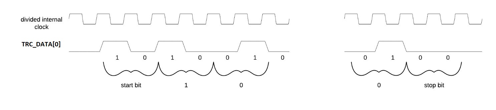
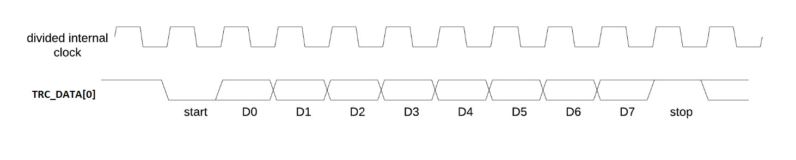
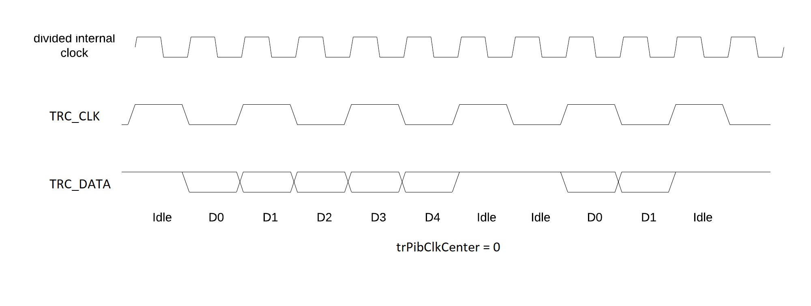
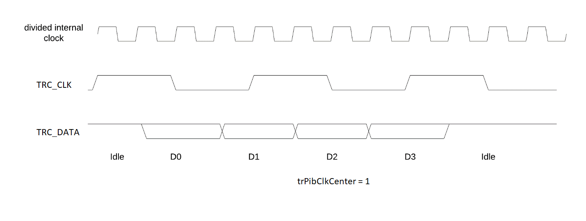

[[header]]
:company: RISC-V
:revdate:  Nov 29, 2022
:revnumber: 0.9.7
:revremark: This document is in Stable state. Assume it may change.
:url-riscv: http://riscv.org
:doctype: book
:preface-title: Preamble
:colophon:
:appendix-caption: Appendix
:title-logo-image: image:docs-resources/images/risc-v_logo.svg[pdfwidth=3.25in,align=center]
// Settings:
:experimental:
:reproducible:
:WaveDromEditorApp: wavedrom-cli
:icons: font
:lang: en
:listing-caption: Listing
:sectnums:
:sectnumlevels: 5
:toclevels: 5
:toc: left
:source-highlighter: pygments
ifdef::backend-pdf[]
:source-highlighter: coderay
endif::[]
:data-uri:
:hide-uri-scheme:
:stem: latexmath
:footnote:
:xrefstyle: short 

= Specification of RISC-V Trace Control Interface

// table of contents
toc::[]

[NOTE]
.Copyright and licensure:
====
This work is licensed under a
link:http://creativecommons.org/licenses/by/4.0/[Creative Commons Attribution 4.0 International License].

This work is Copyright 2022 by RISC-V International.
==== 

[preface]
== Document State

2022/11/29: Version 0.9.7-Stable

NOTE: See https://wiki.riscv.org/display/HOME/Specification+States for explanation of specification states.

[preface]
== History and status

NOTE: After approval by the group and status change from Stable to Frozen this chapter will be removed.

2022/11/29: Version 0.9.7-Stable

* Improved "Accessing Trace Control Registers" chapter
* Fixed too narrow columns in some tables

2022/11/28: Version 0.9.6-Stable

* Big re-structuring (split into separared components) as discussed.
* Consistent naming for all registers and fields (tr...) - each name of 'unique'.
* Allowing 64-bit values for RAM Sink WP/RP/Limit registers (allowing trace bigger than 4GB).
* Other minor clarifying changes.

2022/11/1: Version 0.9.5-Stable (never generated)

2022/8/15: Version 0.9.4-Stable.

* Most clarifying notes/suggestions (by Markus in email from 2022/8/12) taken into account

** STILL TODO: Elaborate on 'funnels' and 'timestamps' sections (with graphics)

2022/8/9: Version 0.9.3-Stable. Key changes (after discussions/comments)

* Added dedicated Trace Filter block at offset 0x300
* Changed 'teTracing' into 'teInstTracing'
* Removed 'write 0 to clear'
* Adding 'teControl.teContext'
* Clarification of disable and flush

2022/5/10: Creation of PDF and adjustments of table columns widths. Referenced "Efficient Trace for RISC-V Version 2.0" 

2021/12/13: Candidate for Frozen - compatible with E-Trace 1.1.3-Frozen

2021/3/02: Changes toward control share with E-Trace specifications

2020/6/21: Initial ADOC creared (from PDF)

== Introduction

This document presents a control interface for the Trace Encoder described in the _Efficient Trace for RISC-V Specification Version 2.0_ and for the RISC-V N-Trace specification (in progress). Both Trace Working Groups agreed to standardize the control interface so that trace control software development tools can be used interchangeably with any RISC-V device implementing processor and/or data trace.

Instruction Trace is a system that collects a history of processor execution, along with other events. The trace system may be set up and controlled using a register-based interface. Core execution activity appears on the Ingress Port and feeds into a Trace Encoder where it is compressed and formatted into trace messages. The Trace Encoder transmits trace messages to a Trace Sink. In multi-core systems, each core has its own Trace Encoder, and typically all will connect to a Trace Funnel that aggregates trace data from multiple sources and sends the data to a single destination.

This specification does not define the hardware interconnection between the core and Trace Encoder, as this is defined in the _Efficient Trace for RISC-V Specification Version 2.0_. This document also does not define the hardware interconnection between the Trace Encoder and Trace Funnel, or between the Trace Encoder/Funnel and Trace Sink.

This specification allows a wide range of implementations including low-gate-count minimal instruction trace and systems with only instrumentation trace. Implementation choices include whether to support branch trace, data trace, instrumentation trace, timestamps, external triggers, various trace sink types, and various optimization tradeoffs between gate count, features, and bandwidth requirements.

== Glossary

*Trace Encoder* - Hardware module that accepts execution information from a core and generates a stream of trace messages/packets.

*Trace Message/Packet* - Depending on protocol different names can be used, but it means the same. It is considered as continous sequence of (usully bytes) describing program and/or data flow.

*Trace Funnel* - Hardware module that combines trace streams from multiple Trace Encoders into a single output stream.

*Trace Sink* - Hardware module that accepts a stream of trace messages and records them in memory or forwards them onward in some format.

*Trace Decoder* - Software program that takes a recorded trace (from Trace Sink) and produces readable execution history.

*WARL* - Write any, read legal. If a non-legal value is written, the writen value must be ignored and register will keep previous, legal value. Used by debugger to determine system capabilities. See Discovery chapter.

*ATB* - Advanced Trace Bus, a protocol described in ARM document IHI0032B.

*PIB* - Pin Interface Block, a parallel or serial off-chip trace port feeding into a trace probe.

== Control Interface

The Trace Control interface consists of a set of 32-bit registers. The control interface can be used to set up and control a trace session, retrieve collected trace, and control any trace system components.

=== Trace Components

This specification defines the following trace components:

//[cols="15%,15%,10%,~",options="header",]
[%autowidth]
|===
|*Component Name* |*Component Type (value=symbol)*|*Base Address (symbol)* |*Description*
|Trace Encoder |0x1=TRCOMP_ENCODER|trBaseEncoder|Accepts execution information from a core (via Trace Ingress Port) and generates a stream of trace messages/packets.
|Trace Funnel |0x8=TRCOMP_FUNNEL|trBaseFunnel|Acccepts several trace message/packet streams and  merges them into single stream of messages/packes.
|Trace RAM Sink |0x9=TRCOMP_RAMSINK|trBaseRamSink|Accepts trace messages/packets and stores them into memory buffer (either dedicated SRAM or System Bus).
|Trace PIB Sink |0xA=TRCOMP_PIBSINK|trBasePibSink|Accepts trace messages/packets and sends them via set of pins (parallel or serial).
|Trace ATB Sink |0xB=TRCOMP_PIBSINK|trBaseAtbSink|Accepts trace messages/packets and sends them to ATB bus in a system.
|===

NOTE: This specification is NOT addressing discovery of base addresses of trace components. These base addresses (trBase... symbols in above table) must be specified as part of trace tool configuration. Connections between different trace components must be also defined. Future version of this specification may allow single base address to be sufficient to access all components in the system.

Each Trace Component is controlled by set of 32-bit registers occupying up to a 4K-byte space. Base address of each trace component must be aligned on 4K boundary.

There is typically one Trace Encoder per hart. A core with multiple harts (i.e., multi-threaded) must generate messages with a field indicating which hart is responsible for that message.

The Trace Funnel allows to combine several trace sources (from Trace Encoders or other Trace Funnels) into one trace stream. 

The Trace Sink (connected to output from Trace Encoder or Trace Funnel) stores trace messages/packets to memory or sends them out of SoC.

=== Accessing Trace Control Registers

The following methods are recommented to access memory mapped Trace Control registers:

* Memory accesses through RISC-V debug module using SBA (System Bus Access) as defined in RISC-V Debug Specification. Using SBA access (via debug module) is essential to make sure that trace registers are accessible while core/hart is running. It allows external debugger to monitor trace status and to control trace captures without stopping the core being traced.

* Through loads and stores performed by one or more harts in the system. Mapping the control interface into physical memory accessible from a hart allows that hart to manage a trace session independently from an external debugger. A hart may act as an internal debugger or may act in cooperation with an external debugger. Two possible use models are collecting crash information in the field and modifying trace collection parameters during execution. If a system has physical memory protection (PMP), a range can be configured to restrict access to the trace system from hart(s).

NOTE: Additional control path(s) may also be implemented, such as extra JTAG registers or devices, a dedicated DMI debug bus or message-passing network. Such an access (which is NOT based on System Bus) may require custom implementation by trace probe vendors as this specification only mandates probe vendors to provide access via SBA commands.

=== Trace Component Register Map

Each  block of 32-bit registers (for each component) has the following layout:

[cols="15%,20%,10%,~",options="header",]
|===
|*Address Offset* |*Register Name* |*Compliance* |*Description*
|0x000 |tr??Control |Required |Main control register for trace component ??
|0x004 |tr??Impl |Required |Trace Implementation information for component ??
|0x008 |tr??Control2 |Optional |Additional controls for component ?? (can be named differently)
|0x00C |tr??Control3 |Optional |Additional controls for component ?? (can be named differently)
|0x010 - 0xFFF |-- |Optional |Additional registers (specific for particular component)
|===

Each component has tr??Impl register (at address offset 0x4) where component version and component type can be identified. This registers allows debug tool to verify provided component base address and potentially adjust tool behaviour by looking at component version.

NOTE: Each component may have different version. Initial version of this specificiation define all components to specify component version 1.

Registers in the 4K range that are not implemented read as 0 and ignore writes.

Most of trace control registers are optional. Some WARL fields may be hard-coded to any value (including 0). It allows different implementations to provide different functionality.

Both N-Trace and E-Trace encoders are controlled by the same set of bits/fields in same registers. As almost every register/field/bit is optional this provides good flexibility in implementation.

*Trace Encoder Registers (trTe..., trTs...)*

[cols="15%,20%,10%,~",options="header",]
|===
|*Address Offset* |*Register Name* |*Compliance* |*Description*
|0x000 |trTeControl |Required |Trace Encoder control register
|0x004 |trTeImpl |Required |Trace Implementation information
|0x008 |trTeInstFeatures |Optional |Extra instruction trace encoder features
|0x00C |-- |Optional |Reserved (for more instruction trace controls)
4+|_Data trace control (trTeData...)_
|0x010 |trTeDataControl |Optional |Data trace control and features
|0x014 - 0x03F |-- |Optional |Reserved for more registers
4+|_Timestamp control (trTs...)_
|0x040 |trTsControl |Optional |Timestamp control register
|0x044 |-- |Optional |Reserved
|0x048 |trTsCounter |Optional |Lower 32 bits of timestamp counter
|0x04C |trTsCounterHigh |Optional |Upper bits of timestamp counter
4+|_Trigger control (trTeTrig...)_
|0x050 |trTeTrigExtInControl |Optional |External Trigger Input control register
|0x054 |trTeTrigExtOutControl |Optional |External Trigger Output control register
|0x058 |trTeTrigDbgControl |Optional |Debug triggers control register
|0x060 - 0x3FF |-- |Optional |Reserved for more registers/sub-components
4+|_Filters & comparators (trTeFilter..., trTeComp...)_
|0x400 - 0x5FF |trTeFilter... |Optional |Trace Encoder Registers
|0x600 - 0x7FF |trTeComp... |Optional |Trace Encoder Comparator Registers
|0x800 - 0xFFF |-- |Optional |Reserved for more registers/sub-components
|===

Examples of possible additional subcomponents in Trace Encoder are:

* PC Sampling
* Instrumentation Trace

*Trace RAM Sink Registers (trRam...)*

[cols="15%,20%,10%,~",options="header",]
|===
|*Address Offset* |*Register Name* |*Compliance* |*Description*
|0x000 |trRamControl |Required |RAM Sink control register
|0x004 |trRamImpl |Required |RAM Sink Implementation information
|0x008 - 0x00F |-- |Optional |Reserved for more control registers
|0x010 |trRamStartLow |Optional |Lower 32 bits of start address of circular trace buffer
|0x014 |trRamStartHigh |Optional |Upper bits of start address of circular trace buffer
|0x018 |trRamLimitLow |Optional |Lower 32 bits of end address of circular trace buffer
|0x01C |trRamLimitHigh |Optional |Upper bits of end address of circular trace buffer
|0x020 |trRamWPLow |Optional |Lower 32 bits of current write location for trace data in circular buffer
|0x024 |trRamWPHigh |Optional |Upper  bits of current write location for trace data in circular buffer
|0x028 |trRamRPLow |Optional |Lower 32 bits of access pointer for trace readback
|0x02C |trRamRPHigh |Optional |Upper bits of access pointer for trace readback
|0x040 |trRamData |Optional |Read/write access to SRAM trace memory (32-bit data)
|0x044 - 0x07F |-- |Optional |Reserved for bigger read buffer
|===

*Trace PIB Sink Registers (trPib...)*

[cols="15%,20%,10%,~",options="header",]
|===
|*Address Offset* |*Register Name* |*Compliance* |*Description*
|0x000 |trPibControl |Required |Trace PIB Sink control register
|0x004 |trPibImpl |Required |Trace PIB Sink Implementation information
|===

*Trace Funnel Sink Registers (trFunnel..., trTs)*

[cols="15%,20%,10%,~",options="header",]
|===
|*Address Offset* |*Register Name* |*Compliance* |*Description*
|0x000 |trFunnelControl |Required |Trace Funnel control register
|0x004 |trFunnelImpl |Required |Trace Funnel Implementation information
4+|_Timestamp control (trTs...)_
|0x040 |trTsControl |Optional |Timestamp control register
|0x044 |-- |Optional |Reserved
|0x048 |trTsCounter |Optional |Lower 32 bits of timestamp counter
|0x04C |trTsCounterHigh |Optional |Upper bits of timestamp counter
|===

*Trace ATB Sink Registers (trAtb...)*

[cols="15%,20%,10%,~",options="header",]
|===
|*Address Offset* |*Register Name* |*Compliance* |*Description*
|0x000 |trAtbControl |Required |Trace ATB Sink control register
|0x004 |trAtbImpl |Required |Trace ATB Sink Implementation information
|===

== Trace Encoder Introduction

This section briefly describes features of the Trace Encoder (TE) as background for understanding some of the control interface register fields.

=== Trace Encoder Types

By monitoring the Ingress Port, the TE determines when a program flow discontinuity has occurred and whether the discontinuity is inferable or non-inferable. An inferable discontinuity is one for which the Trace Decoder can statically determine the destination, such as a direct branch instruction in which the destination or offset is included in the opcode. Non-inferable discontinuities include all other types as interrupt, exception, and indirect jump instructions.

=== Branch Trace Messaging

Branch Trace Messaging is the simplest form of instruction trace. Each program counter discontinuity results in one trace message, either a Direct or Indirect Branch Message. Linear instructions (or sequences of linear instrucions) do not result in any trace messages/packets.

Indirect Branch Messages normally contain a compressed address to reduce bandwidth. The TE emits a Branch With Sync Message containing the complete instruction address under certain conditions. This message type is a variant of the Direct or Indirect Branch Message and includes a full address and a field indicating the reason for the Sync.

=== Branch History Messaging

Both the Efficient Trace for RISC-V (E-Trace) Specification and the Nexus standard define systems of messages intended to improve compression by reporting only whether conditional branches are taken by encoding each branch outcome is encoded in single bit. The destinations of non-inferable jumps and calls are reported as compressed addresses. Much better compression can be achieved, but an Encoder implementation will typically require more hardware.

=== Other Optimizations

Several other optimizations are possible to improve trace compression. These are optional for any Trace Encoder and there should be a way to disable optimizations in case the trace system is used with code that does not follow recommended API rules. Examples of optimizations are a Return-address stack, Branch repetition, Statically-inferable jump, and Branch prediction.

=== Trace Sinks

The Trace Encoder transmits completed messages to a Trace Sink. This specification defines a number of different sink types, all optional, and allows an implementation to define other sink types. A Trace Encoder must have at least one sink attached to it.

NOTE: Trace messages/packets are sequences of bytes. In case of wider sink width, some padding/idle bytes (or additioanl formatting) may be added by particular sink. Nexus format allows any number of idle bytes between messages.

==== SRAM Sink

The Trace Encoder packs trace messages into fixed-width trace words (usually bytes). These are then stored in a RAM, typically located on-chip, in a circular-buffer fashion. When the RAM has filled, the TE may optionally allow trace to be stopped, or it may wrap and overwrite earlier trace.

==== PIB Sink

The Trace Encoder sends trace messages to the PIB Sink. Each message is transmitted off-chip (as sequence of bytes) using a specific protocol described later.

==== System Memory (SBA) Sink

The Trace Encoder packs trace messages into fixed-width trace words. These are then stored in a range of system memory reserved for trace using a DMA-type bus master in a circular-buffer fashion. When the memory range has been filled, the TE may optionally allow trace to be stopped, or it may wrap and overwrite earlier trace. This type of sink may also be used to transmit trace off-chip through, for example, a PCIe or USB port.

==== ATB Sink

The ATB Sink transmits bytes of trace messages as an ATB bus master.

ATB has width, which is either 8 or 32-bit what will well match 'packet=sequence-of-bytes' definition.

==== Funnel Sink

The Trace Encoder sends trace messages to a Trace Funnel. The Funnel aggregates trace from each of its inputs and sends the combined trace stream to its designated Trace Sink, which is one or more of the sink types above.

NOTE: It is assumed, that each input to funnel (trace encoder or another funnel) has unique 'SRC' field defined (this is trTeSrcID field in trTeControl register).

== Trace Encoder Control Interface

Many features of the Trace Encoder are optional. In most cases, optional features are enabled using a WARL (write any, read legal) register field. A debugger can determine if an optional feature is present by writing to the register field and reading back the result.

*Register: trBaseEncoder+0x000 trTeControl: Trace Encoder Control Register (Required)*

[cols="10%,24%,~,8%,8%",options="header",]
|===
|*Bit* |*Field* |*Description* |*RW* |*Reset*
|0 |trTeActive |Primary enable for the TE. When 0, the TE may have clocks gated off or be powered
down, and other register locations may be inaccessible. Hardware may take an arbitrarily long time to process power-up and power-down and will indicate completion when the read value of this bit matches what was written. |RW |0

|1 |trTeEnable |1: TE enabled. Allows trTeInstTracing to turn all tracing on and off. Setting trTeEnable to 0 flushes any queued trace data to sink attached to this encoder. This bit can be set to 1 only by direct write to it.|RW |0

|2 |trTeInstTracing |1: Instruction trace is being generated. Written from tool or controlled by triggers. When trTeInstTracing=1, instruction trace data may be subject to additional filtering in some implementations (additional trTeInstMode settings). |RW |0

|3 |trTeEmpty |Reads as 1 when all generated trace has been emitted. |R |1
|6-4 |trTeInstMode |
Main instruction trace generation mode

0: Instruction trace is disabled

1-2: Reserved for subsets of Branch Trace (for example periodic PC sampling)

3: Generate instruction trace using Branch Trace (each taken branch generate trace)

4-5: Reserved for subset of Branch History Trace

6: Generate non-optimized instruction Branch History Trace (each branch adds single history bit)

7: Generate optimized Instruction Trace (trTeInstFeatures register if present define instruction trace features and optimizations).

|WARL |SD^(1)^
|8-7 |-- |Reserved for futue modes |WARL |SD
|9 |trTeContext |Send Ownership messages to indicate processor context when scontext, mcontext, v, or prv changes and full context information immediately after all Sync messages. |WARL |SD
|10 |-- |Reserved |WARL |SD
|11  |trTeInstTrigEn |1: Allows trTeInstTracing to be set or cleared by trace-on
and trace-off Debug module triggers respectively|WARL |0
|12  |trTeInstStallOrOverflow |Written to 1 by hardware when an overflow message is generated or when the TE requests a core stall. Clears to 0 at TE reset or when trace is enabled (trTeEnable set to 1).|R |0
|13 |trTeInstStallEn |
0: If TE cannot send a message, an overflow is generated when trace is restarted. 

1: If TE cannot send a message, the core is stalled until it can.

|WARL |SD
|14 |trteStopOnWrap |1: Disable trace (trTeInstEnable, trTeDataEnable -> 0) when circular buffer fills for the first time. |WARL |SD

|15 |trTeInhibitSrc |1L Disable source field in trace messages. Unless disabled, a trace source field (of trTeInstFeatures.trTeSrcBits) is added to every trace message to indicate which TE generated each message. If trTeInstFeatures.trTeSrcBits is 0, this bit is not active.

|WARL |SD

|17-16 |trTeSyncMode |Select periodic synchronization mechanism. At least one non-zero mechanism must be implemented.

0: Off

1: Count trace messages/packets

2: Count core clock cycles

3: Count instruction half-words (16-bit)|WARL |SD

|19-18 |Reserved |--|--|0

|23-20 |trTeSyncMax |The maximum interval (in units determined by trTeSyncMode) between synchronization messages/packets. Generate synchronization when count reaches 2^(trTeSyncMax + 4). If synchronization packet is generated from another reason internal counter should be reset.|WARL |SD

|26-24 |trTeFormat a|
Trace recording format

0: Format defined by Efficient Trace for RISC-V (E-Trace) Specification

1: Nexus messages with 6 MDO + 2 MSEO bits

2-6: Reserved for future formats

7: Vendor-specific format

|WARL |SD
|31-28 |trVer0Marker |
This field is read only and reads as 0. Older trace control software will report an error as this field was used to report type of sink and 0 was not allowed.
|R |0
|===

____
SD^(1)^ = System-Dependent, but these fields should always have same values at reset (teActive=0)
____

*Register: trBaseEncoder+0x004 trTeImpl: Trace Encoder Implementation Register (Required)*

[cols="10%,24%,~,8%,8%",options="header",]
|===
|*Bit* |*Field* |*Description* |*RW* |*Reset*
|3-0 |trTeVersion |Trace Encoder Version. Value 1 means module is compliant with this document. Value 0 means legacy version - see 'Legacy Interface Version' chapter at the end. |R | 1

|7-4 |trTeCompType |Trace component type (Trace Encoder) |R |0x1
|===

*Register: trBaseEncoder+0x008 trTeInstFeatures: Trace Instruction Features Register*

[cols="10%,24%,~,8%,8%",options="header",]
|===
|*Bit* |*Field* |*Description* |*RW* |*Reset*

|0 |teInstNoAddrDiff|Do not send differential addresses when set (always full address is sent)|WARL|0

|1 |teInstNoTrapAddr|When set, do not sent trap handler address in trap packets|WARL|0

|2 |teInstEnSequentialJump|Treat sequentially inferrable jumps as inferable PC discontinuities when set.|WARL|0

|3 |teInstEnCallStack|Treat returns as inferable PC discontinuities when returning from recent call on stack.|WARL|0

|4 |teInstEnBranchPrediction|Branch predictor enabled when set.|WARL|0

|5 |teInstEnJumpTargetCache|Jump target cache enabled when set.|WARL|0

|23-16 |trTeSrcID |This TE's source ID. If trTeSrcBits>0 and trace source is not disabled by trTeInhibitSrc, then messages will all include a trace source field of trTeSrcBits bits. Messages from this TE will use this value as trace source field. May be fixed or variable.|WARL |SD

|27-24 |trTeSrcBits |The number of bits in the trace source field, unless disabled by trTeInhibitSrc. May be fixed or variable. |WARL |SD

|===

*Register: trBaseEncoder+0x010 trDataControl: Data Trace Control Register (for encoders supporting data trace)*

[cols="10%,24%,~,8%,8%",options="header",]
|===
|*Bit* |*Field* |*Description* |*RW* |*Reset*

|0 |teDataImplemented|Read as 1 if data trace is implemented.|R|SD
|1 |teDataEnable|Main enable for data trace.|WARL|SD
|2 |teDataTracing |1=Data trace is being generated. Written from tool or controlled by triggers. When trDataTracing=1, data trace  may be subject to additional filtering in some implementations.|WARL |SD
|3 |teDataTrigEnable|Global enable/disable for data trace triggers|WARL |0
|4 |teDataStallDelta|Set to 1 if data trace caused stall since last read. It is clear on read.|R|0
|5 |teDataStallEnable|Stall execution if data trace message cannot be generated.|WARL|0
|6 |teDataDropDelta|Set to 1 if data trace was dropeed since last read. It is clear on read.|R|0
|7 |teDataDropEnable|Allow dropping data trace to avoid instruction trace overflows. Seting this bit will not guarantee that instuction trace overflows will not happen.|WARL|0
|15-8||Reserved for additional data trace control/status bits.|--|--
|16 |teDataNoValue|Omit data values from data trace packets when set.|WARL|SD
|18-17 |teDataAddressMode|'00':Omit data address from data trace packets. '01': Compress data addresses in XOR mode (only LSB bits changed), '10': Compress data addresses in differental mode (+-N offset),'11': reserved or automatic mode.|WARL|SD
|===

== Timestamp Unit

Timestamp Unit is an optional sub-component present in either Trace Encode or Trace Funnel. An implementation may choose from several types of timestamp units: 

* *Internal System* - fixed clock in a system (such as bus clock) is used to increment the timestamp counter
* *Internal Core* - core clock is used to increment the timestamp counter (only applicable to Trace Encoders)
* *Shared* - shares timestamp with another Trace Encoder or Trace Funnel
* *External* - accepts a binary timestamp value from an outside source such as ARM CoreSight(TM) trace

Implementations may have no timestamp, one timestamp type, or more than one type. The WARL field trTsType is used to determine the system capability and to set the desired type.

The width of the timestamp is implementation-dependent, typically 40 or 48 bits (40 bit timestamp will overflow every 4.7 minutes assuming 1GHz timestamp clock).

In a system with Funnels, typically all the Funnels are built with a Timestamp Unit. The top-level Funnel is the source of the timestamp (Internal System or External) and all the Encoders and other Funnels have Shared timestamp. To perform the forwarding function, the mid-level Funnels must be programmed with tfActive=1 (which is natural as all trace messages must pass through that funnel).

An Internal Timestamp Unit may include a prescale divider, which can extend the range of a narrower timestamp and uses less power but has less resolution.

In a system with an Internal Core timestamp counter (implemented in Trace Encoder associated with a core), it may be desirable to stop the counter when the hart is halted by a debugger. An optional control bit is provided for this purpose, but it may or may not be implemented.

=== Timestamp Registers

*Register: trBaseEncoder/Funnel+0x040 trTsControl: Timestamp Control Register (Optional)*

[cols="10%,24%,~,8%,8%",options="header",]
|===
|*Bit* |*Field* |*Description* |*RW* |*Reset*
|0 |trTsActive |Primary reset/enable for timestamp unit |RW |0
|1 |trTsCount |Internal timestamp only. 1=counter runs, 0=counter stopped |RW |0
|2 |trTsReset |Internal timestamp only. Write 1 to reset the timestamp counter |W1 |0
|3 |trTsRunInDebug |Internal Core timestamp only. 1=counter runs when hart is halted (in debug mode), 0=stopped |WARL |0
|6-4 |trTsType a|
Type of Timestamp unit

0: None

1: External

2: Internal System

3: Internal Core

4: Shared

5-7: Vendor-specific type

|WARL |SD
|9-8 |trTsPrescale |Internal timestamp only. Prescale timestamp clock by 2^2n (1, 4, 16, 64). |WARL |0
|15 | trTsEnable |Global enable for timestamps (for Trace Encoder only). |WARL |0
|23-16 | |System-dependent fields to control what message types include timestamps. |WARL |0
|31-24 |trTsWidth |Width of timestamp in bits |R |SD
|===

*Register: trBaseEncoder/Funnel+0x048 trTsCounterLow: Timestamp Lower Bits (Optional)*

[cols="10%,24%,~,8%,8%",options="header",]
|===
|*Bit* |*Field* |*Description* |*RW* |*Reset*
|31-0 |trTsCounterLow |Lower 32 bits of timestamp counter. |R |0
|===

*Register: trBaseEncoder/Funnel+0x04C trTsCounterHigh: Timestamp Upper Bits (Optional)*

[cols="10%,24%,~,8%,8%",options="header",]
|===
|*Bit* |*Field* |*Description* |*RW* |*Reset*
|31-0 |trTsCounterHigh |Upper bits of timestamp counter, zero-extended. |R |0
|===

== External Triggers

The TE may be configured with up to 8 external trigger inputs for controlling trace. These are in addition to the external triggers present in the Debug Module when Halt Groups are implemented. The specific hardware signals comprising an external trigger are implementation-dependent.

External Trigger Outputs may also be present. A trigger out may be generated by trace starting, trace stopping, a watchpoint, or by other system-specific events.

=== External Trigger Registers

*Register: trBaseEncoder+0x050 trTeTrigExtInControl: External Trigger Input Control Register (Optional)*

[cols="10%,24%,~,8%,8%",options="header",]
|===
|*Bit* |*Field* |*Description* |*RW* |*Reset*
|3-0 |trTeTrigExtInAction0 a|
Select action to perform when external trigger input 0 fires. If external trigger input 0 does not exist, then its action is fixed at 0.

0: No action

1: Reserved

2: Start trace (teInstTracing -> 1)

3: Stop trace (teInstTracing -> 0)

4: Record Program Trace Sync message

5-15: reserved

|WARL |0
|31-4 |trTeTrigExtInAction__n__ |Select actions for external triggers 1 through 7. If an external trigger input does not exist, then its action is fixed at 0. |WARL |0
|===

*Register: trBaseEncoder+0x054 trTeTrigExtOutControl: External Trigger Output Control Register (Optional)*

[cols="10%,24%,~,8%,8%",options="header",]
|===
|*Bit* |*Field* |*Description* |*RW* |*Reset*
|3-0 |trTeTrigExtOutEvent0 a|
Bitmap to select which event(s) cause external trigger 0 output to fire. If external trigger output 0 does not exist, then all bits are fixed at 0. Bits 2 and 3 may be fixed at 0 if the corresponding feature is not implemented.

0: Start trace (teInstTracing 0 -> 1)

1: Stop trace (teInstTracing 1 -> 0)

2-3: Vendor-specific event (optional)

|WARL |0
|31-4 |trTeTrigExtOutEvent__n__ |Select events for external trigger outputs 1 through 7. If an external trigger output does not exist, then its event bits are fixed at 0 |WARL |0
|===

== Debug Triggers

Debug triggers are signals from the core that a trigger (breakpoint or watchpoint) was hit, but the action associated with that trigger is a trace-related action. Action identifiers 2-5 are reserved for trace actions in the RISC-V Debug Spec, where triggers are defined. Actions 2-4 are defined by the Efficient Trace for RISC-V (E-Trace) Specification. The desired action is written to the action field of the Match Control mcontrol CSR (0x7a1). Not all cores support trace actions; the debugger should read back mcontrol CSR after setting one of these actions to verify that the option exists.

[cols="20%,~",options="header",]
|===
|*Action (from debug spec)* |*Effect*
|0 |Breakpoint exception
|1 |Debug exception
|2 |Start trace (trTeInstTracing -> 1)
|3 |Stop trace (teTeInstTracing -> 0)
|4 |Record Program Trace Sync message
|5 |Optional vendor-specific action
|===

If there are vendor-specific features that require control, the trtrTeTrigDbgControl register is used. 

*Register: trBaseEncoder+0x058 trTeTrigDbgControl: Debug Trigger Control Register*

[cols="10%,24%,~,8%,8%",options="header",]
|===
|*Bit* |*Field* |*Description* |*RW* |*Reset*
|31-0 |-- |Vendor-specific trigger setup |WARL |0
|===

=== Debug Triggers Precedence

It is implementation-dependent what happens when debug triggers or external triggers with conflicting actions occur simultaneously or if debug triggers or external triggers occur too frequently to process.

== Trace Filter Registers

All registers with offsets 0x400 .. 0x7FC are reserved for additional trace encoder filtering options (context, addresses, modes etc.).

Specifications for different trace encoders should define registers in this range.

*N-Trace:*    Only Debug Trigger based filtering is defined in this version.

*E-Trace:*    Additional trace filtering as defined by register map defined below. Provision is made for upto 16 filters and 8 comparators, indexed by _i_ and _j_ respectively (_i_ is in the range 0 - 15; _j_ is in the range 0 - 7).

[cols="15%,20%,14%,~",options="header",]
|===
|*Address Offset*   |*Trace Encoder*  |*Compliance* |*Description*
|0x400 + 0x20*__i__ |trTeFilter__i__Control |Optional |Filter _i_ control
|0x404 + 0x20*__i__ |trTeFilter__i__MatchInst |Optional |Filter _i_ instruction match control
|0x408 + 0x20*__i__ |trTeFilter__i__MatchEcause |Optional |Filter _i_ Ecause match control
|0x40C + 0x20*__i__ |- | Optional |reserved
|0x410 + 0x20*__i__ |trTeFilter__i__MatchValueImpdef |Optional |Filter _i_ impdef value
|0x414 + 0x20*__i__ |trTeFilter__i__MatchMaskImpdef |Optional |Filter _i_ impdef mask
|0x418 + 0x20*__i__ |trTeFilter__i__MatchData |Optional |Filter _i_ Data trace match control
|0x41C + 0x20*__i__ |- |Optional |reserved
|| | |
|0x600 + 0x20*__j__ |trTeComp__j__Control |Optional |Comparator _j_ control
|0x604 + 0x20*__j__ |- |Optional |reserved
|0x608 + 0x20*__j__ |- |Optional |reserved
|0x60c + 0x20*__j__ |- |Optional |reserved
|0x610 + 0x20*__j__ |trTeComp__j__PmatchLow |Optional |Comparator _j_ primary match (bits 31:0)
|0x614 + 0x20*__j__ |trTeComp__j__PmatchHigh |Optional |Comparator _j_ primary match (bits 63:32)
|0x618 + 0x20*__j__ |trTeComp__j__SmatchLow |Optional |Comparator _j_ secondary match (bits 31:0)
|0x61C + 0x20*__j__ |trTeComp__j__SmatchHigh |Optional |Comparator _j_ secondary match (bits 63:32)

|===

*Register: trBaseEncoder+0x400 + 0x20__i__ trTeFilter__i__Control : Filter _i_ Control Register*
[cols="10%,24%,~,8%,8%",options="header",]
|===
|*Bit* |*Field* |*Description* |*RW* |*Reset*
|0     |trTeFilterEnable | Overall filter enable | WARL | 0 
|1     |trTeFilterMatchPrivilege | 
When set, match privilege levels specified by trTeFilter__i__MatchInstControl.teMatchChoicePrivilege.
| WARL | 0
|2     |trTeFilterMatchEcause | 
When set, start matching from exception cause codes specified by trTeFilter__i__MatchChoiceEcause.teMatchChoiceEcause, and
stop matching upon return from the 1st matching exception.
| WARL | 0
|3     |trTeFilterMatchInt | 
When set, start matching from a trap with the interrupt level codes specified by 
trTeFilter__i__MatchInstControl.teMatchValueInterrupt, and stop matching upon return from the 1st matching trap.
| WARL | 0
|4     |trTeFilterMatchComp1 | 
When set, the output of the comparator selected by trTeFilterMatchComp1 must be high in order for the filter to match.
| WARL | 0
|7-5   | trTeFilterComp1 |
Specifies the comparator unit to use for the 1st comparison.
| WARL | SD
|8     |trTeFilterMatchComp2 | 
When set, the output of the comparator selected by trTeFilterMatchComp2 must be high in order for the filter to match.
| WARL | 0
|11-9  | trTeFilterComp2 |
Specifies the comparator unit to use for the 2nd comparison.
| WARL | SD
|12    |trTeFilterMatchComp3 | 
When set, the output of the comparator selected by trTeFilterMatchComp3 must be high in order for the filter to match.
| WARL | 0
|15-13 | trTeFilterComp3 |
Specifies the comparator unit to use for the 3rd comparison.
| WARL | SD
|16    |trTeFilterMatchImpdef | 
When set, match *impdef* values as specified by trTeFilter__i__MatchValueImpdef.teMatchValueImpdef and 
trTeFilter__i__MatchValueImpdef.teMatchMaskImpdef.
| WARL | 0
|23-17 | reserved||0|0
|24    |trTeFilterMatchDtype | 
When set, match *dtype* values as specified by trTeFilter__i__MatchDataControl.teMatchChoiceDtype.
| WARL | 0
|25    |trTeFilterMatchDsize | 
When set, match *dsize* values as specified by trTeFilter__i__MatchDataControl.teMatchChoiceDsize.
| WARL | 0
|31-26 | reserved||0|0
|===

*Register: trBaseEncoder+0x404 + 0x20__i__ trTeFilter__i__MatchInst : Filter _i_ Instruction Match Control Register*
[cols="10%,24%,~,8%,8%",options="header",]
|===
|*Bit* |*Field* |*Description* |*RW* |*Reset*
|7-0   |trTeFilterMatchChoicePrivilege | 
When trTeFilter__i__Control.trTeFilterMatchPrivilege is set, match all privilege
levels for which the corresponding bit is set. For example, if bit N is 1, then match if the *priv* value is N
| WARL | SD 
|8     |trTeFilterMatchValueInterrupt |
When trTeFilter__i__Control.trTeFilterMatchInterrupt is set, match *itype* of 2 or 1 depending on whether this bit is 1 or 0
respectively.
| WARL | SD 
|31-9 | reserved||0|0
|===

*Register: trBaseEncoder+0x408 + 0x20__i__ trTeFilter__i__MatchEcause : Filter _i_ Ecause Match Control Register*
[cols="10%,24%,~,8%,8%",options="header",]
|===
|*Bit* |*Field* |*Description* |*RW* |*Reset*
|31-0   |trTeFilterMatchChoiceEcause | 
When trTeFilter__i__Control.trTeFilterMatchEcause is set, match all excepion causes for which the corresponding bit is set. For
example, if bit N is 1, then match if the *ecause* is N.
| WARL | SD 
|===

*Register: trBaseEncoder+0x410 + 0x20__i__ trTeFilter__i__MatchValueImpdef : Filter _i_ Impdef Match Value Register*
[cols="10%,24%,~,8%,8%",options="header",]
|===
|*Bit* |*Field* |*Description* |*RW* |*Reset*
|31-0   |trTeFilterMatchValueImpdef | 
When trTeFilter__i__Control.trTeFilterMatchimpdef is set, match if
(*impdef* & trTeFilterMatchMaskImpdef) ==
(trTeFilterMatchValueImpdef & trTeFilterMatchMaskImpdef.
| WARL | SD 
|===

*Register: trBaseEncoder+0x414 + 0x20__i__ trTeFilter__i__MatchMaskImpdef : Filter _i_ Impdef Match Mask Register*
[cols="10%,24%,~,8%,8%",options="header",]
|===
|*Bit* |*Field* |*Description* |*RW* |*Reset*
|31-0   |trTeFilterMatchMaskImpdef | 
When trTeFilter__i__Control.trTeFilterMatchimpdef is set, match if
(*impdef* & trTeFilterMatchMaskImpdef) ==
(trTeFilterMatchValueImpdef & trTeFilterMatchMaskImpdef.
| WARL | SD 
|===

*Register: trBaseEncoder+0x418 + 0x20__i__ trTeFilter__i__MatchData : Filter _i_ Data Match Control Register*
[cols="10%,24%,~,8%,8%",options="header",]
|===
|*Bit* |*Field* |*Description* |*RW* |*Reset*
|15-0   |trTeFilterMatchChoiceDtype | 
When trTeFilter__i__Control.trTeFilterMatchDtype is set, match all data access types
for which the corresponding bit is set. For example, if bit N is 1, then match if the *dtype* value is N.
| WARL | SD 
|23-16  |trTeFilterMatchChoiceDsize |
When trTeFilter__i__Control.trTeFilterMatchDsize is set, match all data access sizes
for which the corresponding bit is set. For example, if bit N is 1, then match if the *dsize* value is N.
| WARL | SD 
|31-24 | reserved||0|0
|===

*Register: trBaseEncoder+0x600 + 0x20__j__ trTeComp__j__Control : comparator _j_ Control Register*
[cols="10%,24%,~,8%,8%",options="header",]
|===
|*Bit* |*Field* |*Description* |*RW* |*Reset*
|1-0   |trTeCompPInput | 
Determines which input to compare against the primary comparator. 

0: *iaddr*

1: *context*

2: *tval*

3: *daddr*

| WARL | SD 
|3-2   |trTeCompSInput | Determines which input to compare against the secondary comparator.  Same encoding as trTeCompPInput. |WARL |SD
|6-4   |trTeCompPFunction |
Selects the primary comparator function.  Primary result is true if input selected via trTeCompPInput is:

0: equal to trTeCompPMatch

1: not equal to trTeCompPMatch

2: less than to trTeCompPMatch

3: less than or equal to trTeCompPMatch

4: greater than to trTeCompPMatch

5: greater than or equal to trTeCompPMatch

6: Result always false (input ignored).  Prime latch to 1 if trTeCompMatchMode is 3

7: Result always true (input ignored)
| WARL | SD
|7     | reserved||0|0
|10-8   |trTeCompSFunction |
Selects the secondary comparator function.  Secondary result is true if input selected via trTeCompSInput is:
0: equal to trTeCompSMatch

1: not equal to trTeCompSMatch

2: less than to trTeCompSMatch

3: less than or equal to trTeCompSMatch

4: greater than to trTeCompSMatch

5: greater than or equal to trTeCompSMatch

6: Result always true (input ignored).  Use trTeCompSMatch as a mask for trTeCompPMatch

7: Result always true (input ignored)
| WARL | SD
|11     | reserved||0|0
|13-12   |trTeCompMatchMode |
Selects the match condition used to assert the overal comparator output

0: primary result true

1: primary and secondary result both true: (P && S)

2: Either primary or secondary result does not match: !(P && S)

3: Set when primary result is true and continue to assert
until instruction after secondary result is true

| WARL | SD
|14   |trTeCompPNotify | 
Generate a trace packet explicitly reporting the address
of the final instruction in a block that causes a
primary match (requires trTeCompPInput to be 0). This is also
known as a watchpoint.
|WARL |SD
|15   |trTeCompSNotify | 
Generate a trace packet explicitly reporting the address
of the final instruction in a block that causes a
secondary match (requires trTeCompSInput to be 0). This is also
known as a watchpoint.
|WARL |SD
|===

*Register: trBaseEncoder+0x610 + 0x20__j__ trTeComp__j__PMatchLo : comparator _j_ Primary match (low) Register*
[cols="10%,24%,~,8%,8%",options="header",]
|===
|*Bit* |*Field* |*Description* |*RW* |*Reset*
|31-0   |trTeCompPMatchLow | 
The match value for the primary comparator (bits 31:0).
| WARL | SD 
|===

*Register: trBaseEncoder+0x614 + 0x20__j__ trTeComp__j__PMatchHi : comparator _j_ Primary match (high) Register*
[cols="10%,24%,~,8%,8%",options="header",]
|===
|*Bit* |*Field* |*Description* |*RW* |*Reset*
|31-0   |trTeCompPMatchHigh | 
The match value for the primary comparator (bits 63:32).
| WARL | SD 
|===

*Register: trBaseEncoder+0x618 + 0x20__j__ trTeComp__j__SMatchLo : comparator _j_ Secondary match (low) Register*
[cols="10%,24%,~,8%,8%",options="header",]
|===
|*Bit* |*Field* |*Description* |*RW* |*Reset*
|31-0   |trTeCompSMatchLow | 
The match value for the secondary comparator (bits 31:0).
| WARL | SD 
|===

*Register: trBaseEncoder+0x61C + 0x20__j__ trTeComp__j__SMatchHi : comparator _j_ Secondary match (high) Register*
[cols="10%,24%,~,8%,8%",options="header",]
|===
|*Bit* |*Field* |*Description* |*RW* |*Reset*
|31-0   |trTeCompSMatchHigh | 
The match value for the secondary comparator (bits 63:32).
| WARL | SD 
|===

== Trace RAM Sink

Registers defined in this chapter are applicable to both SRAM and SBA sinks. SRAM sink type is using dedicated memory, while SBA type is accessign memory via system bus (care should be taken to not overwrite application code or data - it is usually done by reserving part of system memory for trace). Dedicated SRAM memory must be read via dedicated register, while SBA memory should be read as any other memory on system bus.

Trace data is placed in memory in LSB order (first byte of trace packet/data is placed on LSB). For N-trace packets, MSEO bits are placed on LSB bits of each byte.

Be aware that in case trace memory wraps around some protocols may require additional synchronization data - it is usually done by periodically generating sequence of bytes which cannot be part of any valid packet. N-Trace protocol does not require it as it is self-synchronizing - last byte of each message/packet is specially marked.

*Register: trBaseRam+0x000 trRamControl: Trace RAM Sink Control Register*

[cols="8%,24%,~,8%,10%",options="header",]
|===
|*Bit* |*Field* |*Description* |*RW* |*Reset*
|0 |trRamActive |Primary enable for Trace RAM Sink. When 0, the Trace RAM Sink may have clocks gated off or be powered
down, and other register locations may be inaccessible. Hardware may take an arbitrarily long time to process power-up and power-down and will indicate completion when the read value of this bit matches what was written. |RW |0
|1 |trRamEnable |1=Trace RAM Sink enabled. Setting trRamEnable to 0 flushes any queued trace data to output.|RW |0
|2 |Reserved |--|--|0
|3 |trRamEmpty |Reads 1 when Trace RAM Sink internal buffers are empty |R |1
|===

*Register: trBaseRamSink+0x004 trRamImpl: Trace RAM Sink Implementation Register*

[cols="8%,24%,~,8%,10%",options="header",]
|===
|*Bit* |*Field* |*Description* |*RW* |*Reset*
|3-0 |trRamVersion |Trace RAM Sink Component Version. Value 1 means module is compliant with this document. |R | 1
|7-4 |trRamCompType |Trace RAM Sink Component Type (Trace RAM Sink) |R | 0x9(0b1001)
|===

*Register: trBaseRamSink+0x010 trRamStartLow: Trace RAM Sink Start Register (Optional)*

For busses with address larger than 32-bit, corresponding 'High' register define MSB part of larger address. 

NOTE: FUTURE: Another extension should deal with signalling (and clearing ...) RAM access errors (especially important for System Bus). Maybe we should have a bit in 'WP' register (where we have 'teWrap' already) as this register must be read by decoder anyway.

[cols="10%,24%,~,8%,8%",options="header",]
|===
|*Bit* |*Field* |*Description* |*RW* |*Reset*
|1-0 |--|Always 0 (two LSB of 32-bit address)|R|0
|31-2 |trRamStartLow |Byte address of start of trace sink circular buffer. It is always aligned on 32-bit/4-byte boundary. This register may not be implemented if the sink type doesn't require an address. An SRAM sink will usually have trRamStartLow fixed at 0. |WARL |Undef or fixed to 0
|===

*Register: trBaseRamSink+0x014 trRamStartHigh: Trace RAM Sink Start High Bits Register (Optional)*

[cols="10%,24%,~,8%,8%",options="header",]
|===
|*Bit* |*Field* |*Description* |*RW* |*Reset*
|31-0 |trRamStartHigh |High order bits (63:32) of trRamStart registeer. |WARL |Undef
|===

*Register: trBaseRamSink+0x018 trRamLimitLow: Trace RAM Sink Limit Register (Optional)*

[cols="10%,24%,~,8%,8%",options="header",]
|===
|*Bit* |*Field* |*Description* |*RW* |*Reset*
|1-0 |--|Always 0 (two LSB of 32-bit address)|R|0
|31-2 |trRamLimit |Highest absolute 32-bit part of address of trace circular buffer. The trRamWP register is reset to trRamStart after a trace word has been written to this address. This register may not be present if the sink type doesn't require a limit address. |WARL |Undef
|===

*Register: trBaseRamSink+0x01C trRamLimitHigh: Trace RAM Sink Limit High Bits Register (Optional)*

[cols="10%,24%,~,8%,8%",options="header",]
|===
|*Bit* |*Field* |*Description* |*RW* |*Reset*
|31-0 |trRamStartHigh |High order bits (63:32) of trRamLimit register. |WARL |Undef
|===

*Register: trBaseRamSink+0x020 trRamWPLow: Trace RAM Sink Write Pointer Register (Optional)*

[cols="10%,24%,~,8%,8%",options="header",]
|===
|*Bit* |*Field* |*Description* |*RW* |*Reset*
|0 |teWrap |Set to 1 by hardware when trRamWP wraps. It is only set to 0 if trRamWp is written|WARL |0
|1 |--|Always 0 (bit B1 of 32-bit address)|R|0
|32-2 |trRamWP |Absolute 32-bit part of address in trace sink memory where next trace message will be written. Fixed to natural boundary. After a trace word write occurs while trRamWP=trRamLimit, trRamWP is set to trRamStart. This register may not be present if no sinks require it. |WARL |Undef
|===

*Register: trBaseRamSink+0x024 trRamWPHigh: Trace RAM Sink Write Pointer High Bits Register (Optional)*

[cols="10%,24%,~,8%,8%",options="header",]
|===
|*Bit* |*Field* |*Description* |*RW* |*Reset*
|31-0 |trRamStartHigh |High order bits (63:32) of trRamWP register.|WARL |Undef
|===

*Register: trBaseRamSink+0x020 trRamRP: Trace RAM Sink Access Pointer Register (Optional)*

[cols="10%,24%,~,8%,8%",options="header",]
|===
|*Bit* |*Field* |*Description* |*RW* |*Reset*
|N-2 |trRamRP |Absolute 32-bit part of address in trace circular memory buffer visible through trRamData. Auto-increments (with wrap around) following an access to trRamData. Required for SRAM sink and optional for all other sink types. |WARL |0
|===

*Register: trBaseRamSink+0x024 trRamData: Trace RAM Sink Data Register (Optional)*

[cols="10%,24%,~,8%,8%",options="header",]
|===
|*Bit* |*Field* |*Description* |*RW* |*Reset*
|31-0 |trRamData |Read (and optional write) value for trace sink memory access. SRAM is always accessed by 32-bit words through this path regardless of the actual width of the sink memory. Required for SRAM Sink and optional for other sink types. |R or RW |SD
|===

Implementations when trace buffer in system memory will be bigger than 4GB is desired will be unlikely. 

NOTE: FUTURE: Add 64-bit extensions as 32 MSB bits of size (reading 3 times is needed to be certain about 64-bit value). In order to relieve trace software to read 3 times always, there should be a field/bit saying if RAM size over 32-bit is implemented. It may be also WARL field, which must be set to '1' in order to allow 64-bit size. In most cases, it will never be settable (as 4GB of RAM for trace is rare requirement)

== Trace Funnel

The Trace Funnel combines messages from multiple sources into a single trace stream. It is implementation-dependent how many incoming messages are accepted per cycle and in what order.

*Register: trBaseFunnel+0x000 trFunnelControl: Trace Funnel Control Register*

[cols="8%,24%,~,8%,10%",options="header",]
|===
|*Bit* |*Field* |*Description* |*RW* |*Reset*
|0 |trFunnelActive |Primary enable for trace funnel. When 0, the Trace Funnel may have clocks gated off or be powered
down, and other register locations may be inaccessible. Hardware may take an arbitrarily long time to process power-up and power-down and will indicate completion when the read value of this bit matches what was written. |RW |0
|1 |trFunnelEnable |1=Trace Funnel enabled. Setting trFunnelEnable to 0 flushes any queued trace data to output.|RW |0
|2 |Reserved |--|--|0
|3 |trFunnelEmpty |Reads 1 when Trace Funnel internal buffers are empty |R |1
|===

*Register: trBaseFunnel+0x004 trFunnelImpl: Trace Funnel Implementation Register*

[cols="8%,24%,~,8%,10%",options="header",]
|===
|*Bit* |*Field* |*Description* |*RW* |*Reset*
|3-0 |trFunnelVersion |Trace Funnel Component Version. Value 1 means module is compliant with this document. |R | 1
|7-4 |trFunnelCompType |Trace Funnel Component Type (Trace Funnel) |R | 0x8(0b1000)
|===

NOTE: In the future Trace Funnel should be extended to see to allow checking what Trace Encoders (or other Trace Funnels) are connected to particular funnel (settable bit in Trace Encoder/Funnel register connected to readable bit in Trace Funnel register).

== PIB Trace Sink

Trace data may be sent to chip pins through an interface called the Pin Interface Block (PIB). This interface typically operates at a few hundred MHz and can sometimes be higher with careful constraints and board layout or by using LVDS or other high-speed signal protocol. PIB may consist of just one signal and in this configuration may be called SWT (Serial-Wire Trace). Alternative configurations include a trace reference clock (tref) and  1/2/4/8/16 parallel trace data signals (tdata) timed to that reference. WARL register fields are used to determine specific PIB capabilities.

The modes and behavior described here are intended to be compatible with trace probes available in the market.

NOTE: This chapter is using term 'tref' as trace reference clock and 'tdata' as trace data signals. These corresponds to pins TRC_CLK and TRC_DATA pins on trace connector.

=== PIB Register Interface

*Register: trBasePib+0x000 trPibControl: PIB Sink Control Register (Optional)*

[cols="10%,16%,~,8%,16%",options="header",]
|===
|*Bit* |*Field* |*Description* |*RW* |*Reset*
|0 |trPibActive |Primary enable/reset for PIB Sink block |RW |0
|1 |trPibEnable |
0=PIB does not accept input but holds output(s) at idle state defined by pibMode.

1=Enable PIB to generate output

|RW |0
|2 |Reserved |--|--|0
|3 |trPibEmpty |Reads 1 when PIB internal buffers are empty |R |1
|7-4 |trPibMode |Select mode for output pins. |WARL |0 (PIB is off)
|8 |trPibRefCenter |In parallel modes, adjust tref timing to center of bit period. This can be set only if pibMode selects one of the parallel protocols. Optional. |WARL |SD
|9 |trPibCalibrate |Set this to 1 to generate a repeating calibration pattern to help tune a probe's signal delays, bit rate, etc. The calibration pattern is described below. Optional. |WARL |0
|31-16 |trPibDivider |Timebase selection for the PIB module. The input clock is divided by pibDivider+1. PIB data is sent at either this divided rate or 1/2 of this rate, depending on pibMode. Width is implementation-dependent. |WARL |SD (safe setting for particular SoC)
|===

Software can determine what modes are available by attempting to write each mode setting to the WARL field pibControl.pibMode and reading back to see if the value was accepted.

[cols=",,,",options="header",]
|===
|*Mode* |*trPibMode* |*trPibRefCenter* |*Bit rate*
|Off |0 |X |--
|SWT Manchester |4 |X |1/2
|SWT UART |5 |X |1
|tref + 1 tdata |8 |0 |1
|tref + 2 tdata |9 |0 |1
|tref + 4 tdata |10 |0 |1
|tref + 8 tdata |11 |0 |1
|tref + 16 tdata |12 |0 |1
|tref + 1 tdata |8 |1 |1/2
|tref + 2 tdata |9 |1 |1/2
|tref + 4 tdata |10 |1 |1/2
|tref + 8 tdata |11 |1 |1/2
|tref + 16 tdata |12 |1 |1/2

|===

*Register: trBasePib+0x004 trPibImpl: Trace PIB Implementation Register*

[cols="8%,24%,~,8%,10%",options="header",]
|===
|*Bit* |*Field* |*Description* |*RW* |*Reset*
|3-0 |trPibVersion |Trace PIB Component Version. Value 1 means module is compliant with this document. |R | 1
|7-4 |trPibCompType |Trace PIB Component Type (PIB Sink) |R | 0xA(0b1010)
|===

Since the PIB supports many different modes, it is necessary to follow a particular programming sequence:

* Activate the PIB by setting trPibActive.
* Set the trPibMode, trPibDivider, trPibRefCenter, and trPibCalibrate fields. This will set the tdata outputs to the quiescent state (whether that is high or low depends on trPibMode) and start tref running.
* Activate the receiving device, such as a trace probe.  Allow time for PLL to sync up, if using a PLL with a parallel PIB mode.
* Set trPibEnable.  This enables the PIB to generate output either immediately (calibration mode) or when the trace encoder or funnel begins sending trace messages.

Order of bits and bytes:

* Trace messages/packets are considered as sequence of bytes and are always transmitted with LSB bits/bytes first.
* Nexus MSEO bits are transmitted on LSB part and bit#0 first.
* Idle state must be transmitted as all MSEO and MDO bits = 1.
* In 16-bit mode first byte of message is transmitted on LSB part and MSEO of second/odd byte will be transmitted on bits #8-#9 and MDO on bits #10-#15.

NOTE: Above rules allow receiving probe to skip idle messages.

=== Calibration Mode

In optional calibration mode, the PIB transmits a repeating pattern. Probes can use this to automatically tune input delays due to skew on different PIB signal lines and to adjust to the transmitter's data rate (trPibContro.trPibDivider and trPibControl.trPibRefCenter). Calibration patterns for each mode are listed here. 

[cols="24%,~,~",options="header",]
|===
|*Mode* |*Calibration Bytes* |*Wire Sequence*
|UART, Manchester |AA 55 00 FF |alternating 1/0, then all 0, then all 1
|1-bit parallel |AA 55 00 FF |alternating 1/0, then all 0, then all 1
|2-bit parallel |66 66 CC 33 |2, 1, 2, 1, 2, 1, 2, 1, 0, 3, 0, 3, 3, 0, 3, 0
|4-bit parallel |5A 5A F0 0F |A, 5, A, 5, 0, F, F, 0
|8-bit parallel |AA 55 00 FF |AA, 55, 00, FF
|16-bit parallel |AA AA 55 55 00 00 FF FF|AAAA, 5555, 0000, FFFF
|===

=== SWT Manchester Protocol

In this mode, the PIB outputs complete trace messages encapsulated between a start bit and a stop bit. Each bit period is divided into 2 phases and the sequential values of the tdata[0] pin during those 2 phases denote the bit value. Bits of the message are transmitted LSB first. The idle state of tdata[0] is low in this mode.

[cols=",,",options="header",]
|===
|*Bit* |*Phase 1* |*Phase 2*
|start |1 |0
|logic 0 |0 |1
|logic 1 |1 |0
|stop/idle |0 |0
|===

=== SWT UART Protocol

In UART protocol, the PIB outputs bytes of a trace message encapsulated in a 10-bit packet consisting of a low start bit, 8 data bits, LSB first, and a high stop bit. Another packet may begin immediately following the stop bit or there may be an idle period between packets. When no data is being sent, tdata[0] is high in this mode.

=== PIB Parallel Protocol

Traditionally, off-chip trace has used this protocol. There are a number of parallel data signals and one continuously-running clock reference. The data rate of several parallel signals can be much higher than either of the serial-wire protocols.

As with SWT modes, this protocol is oriented to full trace messages rather than fixed-width trace words. The idle state of tdata is all-ones for Nexus trace and (TBD) for Efficient Trace for RISC-V (E-Trace) Specification. When a message start is detected, this sample and possibly the next few (depending on the width of tdata) are collected until a complete byte has been received. Bytes are transmitted LSB first, with tdata[0] representing the LSB in each beat of data. The receiver continues collecting bytes until a complete message has been received. The criteria for this depends on the trace format. For Nexus, the last byte of a message is one that has mseo=1,1. For E-Trace, the header byte may include a byte count. After the last byte of a message, the data signals may then go their idle state or a new message may begin in the next bit period.

NOTE: Trace messages may start on any (positive or negative) edge of trace clock. Once message is started all bits of that message must be transmitted on concecutive trace clock edges (both positive and negative). Said so, idle sequence may be sent consist of any number of trace clocks edges (positive or negative). But some implementations may always send idle sequences using even number of trace clocks - in such a case all packets will always start on positive or negative trace clock.

The clock reference, tref, normally has edges coincident with the tdata edges. Typically, a trace probe will delay trace data or use a PLL to recover a sampling clock that is twice the frequency of tref and shifted 90 degrees so that its rising edges occur near the center of each bit period. If the PIB implementation supports it, the debugger can set pibRefCenter to change the timing of tref so that there is a tref edge at the center of each bit period on tdata. Note that this option cuts the data rate in half relative to normal parallel mode and still requires the probe to sample tdata on both edges of tref.

This example shows 8-bit parallel mode with pibRefCenter=0 transmitting a 5-byte message followed by a 2-byte message.

And an example showing 8-bit parallel mode transmitting a 4-byte packet with pibRefCenter=1.

== ATB Trace Sink

Some SoCs may have an Advanced Trace Bus (ATB) infrastructure to manage trace produced by other components. In such systems, it is feasible to route RISC-V trace output to the ATB through an ATB Trace Sink. This module manages the interface to ATB, generating ATB trace records that encapsulate RISC-V trace produced by the Trace Encoder or Trace Funnel. There is a control register that includes trace on/off control and a field allowing software to set the DeviceID to be used on the ATB. This DeviceID allows software to extract RISC-V trace from the combined trace. This interface is compatible with AMBA 4 ATB v1.1.

*Register: trAtbBase+0x000 atbControl: ATB Sink Control Register*

[cols="8%,24%,~,8%,10%",options="header",]
|===
|*Bit* |*Field* |*Description* |*RW* |*Reset*
|0 |trAtbActive |Primary enable for the ATB Sink. When 0, the ATB Sink may have clocks gated off or be powered
down, and other register locations may be inaccessible. Hardware may take an arbitrarily long time to process power-up and power-down and will indicate completion when the read value of this bit matches what was written. |RW |0
|1 |trAtbEnable |1=ATB Sink enabled. Setting atbEnable to 0 flushes any queued trace data to ATB.|RW |0
|2 |Reserved |--|--|0
|3 |trAtbEmpty |Reads 1 when ATB internal buffers are empty |R |1
|7-4 | |Reserved |-- |--
|14-8 |trAtbId |ID of this node on ATB. Values of 0x00 and 0x70-0x7F are reserved by the ATB specification and should not be used. |RW |0
|===

*Register: atbBase+0x004 atbImpl: ATB Sink Implementation Register*

[cols="8%,24%,~,8%,10%",options="header",]
|===
|*Bit* |*Field* |*Description* |*RW* |*Reset*
|3-0 |trAtbVersion |ATB Component Version. Value 1 means module is compliant with this document. |R | 1
|7-4 |trAtbCompType |ATB Component Type (ATB Sink) |R | 0xB(0b1011)
|===

An implementation determines the data widths of the connection from the Trace Encoder or Trace Funnel and of the ATB port.

== Reset and Discovery

This chapter describes what trace tool should to to discover 

There are several (independent) reset bits defined by this specification

* trTeActive - reset for TE block (this will disable encoder from single core)
* trPibActive - reset for PIB block (resets Probe Interface Block only)
* trAtbActive - resets ATB Sink Block (resets ATB Sink Interface)

All reset bits should (when kept low) reset most of other fields/bits to defined reset values.

Releasing component from reset may take time - debug tool should monitor (with reasonable timeout) if appropriate bit should changed from 0 to 1. Other fields/bits should remain unchanged (as were set during reset).

NOTE: Some of reset values are defined as 'SD' (system dependent) and these values should reset as well and each time to same value as would be after power-up.

NOTE: Some bigger registers (holding RAM addresseses) may not reset - debugger is expected to write to them before enabling trace. These registers have 'Undef' in reset field. It should not prevent some implementations to reset these.

When component is in reset (single 'active' bit = 0), all control bits (and most registers) should reset. 

Discovery should be performned as follows:

* Reset particular component and capture default values of all registers.
* Release from reset (waiting for acknowledge).
* Set (interesting) WARL fields and read-back values.

== Enabling and Disabling

Enabling should work as follows:

* Release all needed components from reset (starting from Trace Encoders, followed by Trace Funnels and finally Trace Sinks) by setting 'tr??Active=1'
** Wait for confirmation (tr??Active=1)
* Set desired mode and verify if that mode is set (regardless of discovery results)
** For RAM sink, setup addresses (if possible and desired) as these are not reset
** Calibrate PIB (if possible and desired)
* Start physical trace capture (probe dependent)
* Enable RAM/PIB/ATB sinks in appropriate mode by setting 'tr??Enable=1'
** Wait for confirmation (tr??Active=1)
** Verify if particular mode is set 
* Enable funnel[s] is the same way (set trTfEnable=1 and verify if set)
* Enable encoder[s] in the same way (set trTeEnable=1 and verify if set)
* Start core[s] to be traced (core could be already running as well)
* Periodically read 'trTeControl' for status of trace (as it may stop by itself due to triggers)

NOTE: Discovery may not be necessary to enable and test trace during development of SoC. However discovery must be possible and should be tested by SoC designer - this is necessary for trace tools to work with that SoC without any customization.

NOTE: Trace tool may verify particular setting once per session, so subsequent starts of trace may be faster.

Disabling the trace should work as follows:

* Disable and flush trace starting from Encoders, then Funnels and finally Sinks
** Set 'tr??Enable=0' and wait for 'tr??Enable=0' and 'tr??Empty=1' for each trace component
* Stop physical capture if PIB sink was enabled (probe dependent)

Decoding trace

* Decoder (in most cases) must have an access to code which is running on device either by reading it from device or from file containg it (binary/hex/srec/ELF)
* Trace can be read and decoded while trace is being captured
** There is no guarantee that last trace packet is completed until trace is properly flushed and disabled

== Legacy Interface Version

Value of 'teVersion/tfVersion' as 0 means this is original version of this interface.

As there are some implementations with trTeVersion = 0 it is important to provide changes, so tools may work with it.

 Trace components are now separated into 4K blocks

* Some registers/fields got renamed for clarity and uniformity

* Field trTeInstTrigEnable was not present, so global enable/disable for instruction trace triggers was not possible

* Field trTeInstStallDelta was not present, so debugger may not know if core was ever stalled

* Fields teSyncMode and teSyncMax were defined as 'teSyncMaxBTM and teSyncMaxInst' 

* Fields pibEmpty and atbEmpty were not defined (trace control should wait to assure that trace was flushed correctly) 

* Register trTeInstFeatures was not present (was reading as 0)

* Register trTeDataControl register was not present (as version 0 did not support data trace)

* 16-bit parallel mode for PIB was not defined (these implementations were using max 8-bit of parallel trace)

== Original Version Disclaimer

This document was converted to ADOC from original proposal by SiFive hosted here:

https://lists.riscv.org/g/tech-nexus/files/RISC-V-Trace-Control-Interface-Proposed-20200612.pdf

During this conversion (automatic) content was not altered. Later formatting details were (manually) adjusted.

Document Version 20200612

Copyright (C) 2020 SiFive, Inc.

This document is released under a Creative Commons Attribution 4.0 International License

https://creativecommons.org/licenses/by/4.0/

You are free to copy and redistribute the material in any medium or format.

You may remix, transform, and build on the material for any purpose, including commercial.

No warranties are implied.
