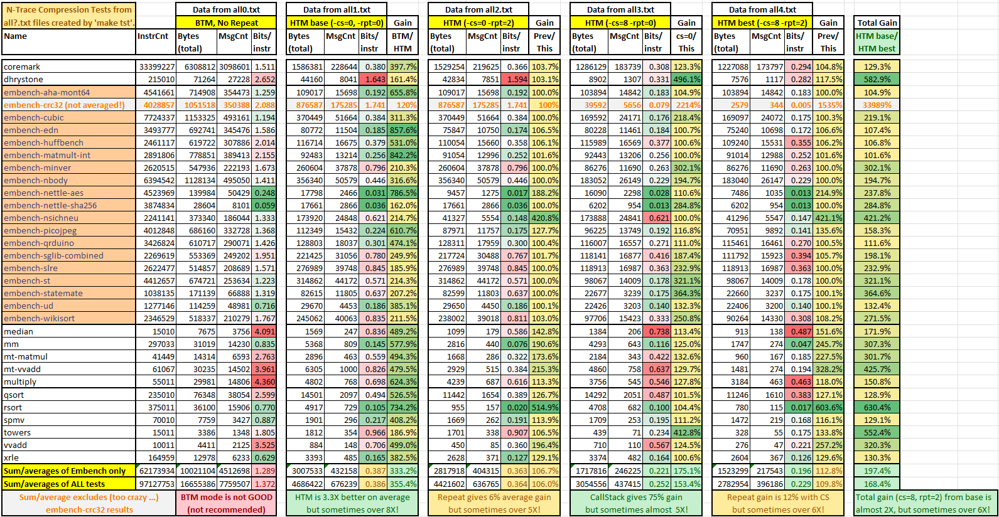

# N-Trace Compression Tests

This directory includes everything to re-run these tests on Ubuntu system. All necessary files (from E-Trace test-set) are collected in [this](./from_etrace) directory.

## Results 

## Notes
* Average HTM mode compression is **better than 0.2 bits/instruction** (but often much better!).
* Above results are consolidated from `all0.txt ... all4.txt` files (obtained by running `make tst`).
* Columns showing `Bits/instr` are color-shaded from red to green to highlight tests with worst/best compression.
* Columns showing `Gain` are color-shaded from yellow to green to highlight tests which gain the most.
* **HTM mode provides 3.3X improvement** over BTM mode (**BTM mode is not recommended**).
* Call-stack with 8 levels (implicit return) and repeated history provides **almost 2X gain over base HTM mode**.

## Files
    ├── README.md                   - This file
    ├── all.txt                     - Created by running 'make all'
    ├── all0.txt                    - Created by running 'make tst' (base for `n-trace-compression.xlsx` file)
    ├── all1.txt
    ├── all2.txt
    ├── all3.txt
    ├── all4.txt
    ├── n-trace-compression.xlsx    - Manually created Excel file with compression summary (from all0-all4.txt files)
    ├── n-trace-compression.png     - Image with compression results (for easier viewing)
    ├── makefile                    - Main makefile (to run tests - see below)
    ├── makelog.txt                 - Creates by running 'make tst >makelog.txt'
    ├── output                      - Directory for output files
    │    └── README.md          
    ├── from_etrace                 - Needed files (taken from E-Trace test set)
    │   ├── README.md
    │   ├── bin_ubuntu
    │   │   ├── *                   - Ubunty version of spike and riscv64-unknown-elf-objdump
    │   ├── spike
    │   │   └── spike.tar.gz        - Collection of all PC sequences created by spike
    │   └── test_files
    │       ├── *.riscv             - All ELF files (run by spike)

## Typical Usage
* `make`              - Run best compression test (statistics in all.txt file)
* `make tst`          - Run all 5 test configurations (all statistics in all?.txt files)
* `make clear`        - Clean all temporary files
